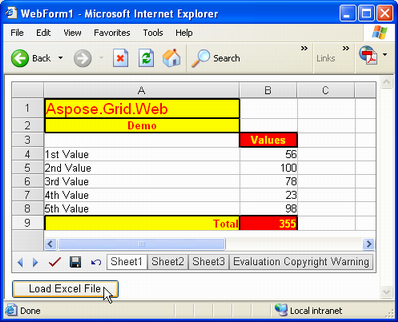

---  
title: Import Microsoft Excel File  
type: docs  
weight: 40  
url: /net/aspose-cells-gridweb/import-microsoft-excel-file/  
keywords: GridWeb,import  
description: This article introduces how to import file in GridWeb.  
ai_search_scope: cells_net  
ai_search_endpoint: "https://docsearch.api.aspose.cloud/ask"
---  

{}  

Like Aspose.Cells.GridDesktop, Aspose.Cells.GridWeb control can open and load Microsoft Excel files — complete with data, formatting, charts, images, etc. — but in web applications. This topic explains how.  

{}  

## **Import Excel Files**  
### **Import from File**  
To open an Excel file using Aspose.Cells.GridWeb control:  

1. Add the Aspose.Cells.GridWeb control to a web form.  
1. Import the Excel file by specifying the file path.  
1. Run the application.  

{}  

If you don't know how to add the control to a web form, refer to [Add GridWeb to Web Form](/cells/net/aspose-cells-gridweb/add-gridweb-to-web-form/).  

{}  

When Aspose.Cells.GridWeb control is added to a web form, the control is automatically instantiated and added to the form with a default size. You don't have to create an Aspose.Cells.GridWeb control object. All you have to do is drag and drop the control and start using it.  

However, to load the content from an Excel file **into** Aspose.Cells.GridWeb control, you have to call the **ImportExcelFile** method to specify the path of the Excel file. After that, Aspose.Cells.GridWeb control will automatically find the file from the specified path and display its contents. A code snippet that loads the contents of an Excel file is provided below.  

  

The above code snippet can be used **in** any way you want. For example, to load an Excel file automatically when a web form loads, add this code to the form's **Page_Load** event. If you want to open a file when a button is clicked, add a button to the web form and write the above code under the button's **Click** event.  

**An Excel file is loaded when a button is clicked**  

  

{}  

If your file system is NTFS, you should grant read‑access permission to the **ASPNET** or **Everyone** user accounts, or you will get an access‑denied exception at runtime.  

{}  

### **Import from Stream**  
As well as opening Excel files from a file, the Aspose.Cells.GridWeb control can load Excel files from a stream. Using a file as a stream is a better approach to avoid any file‑access or sharing‑violation problems because this approach ensures that all connections to the files are closed by closing the stream.  

  
