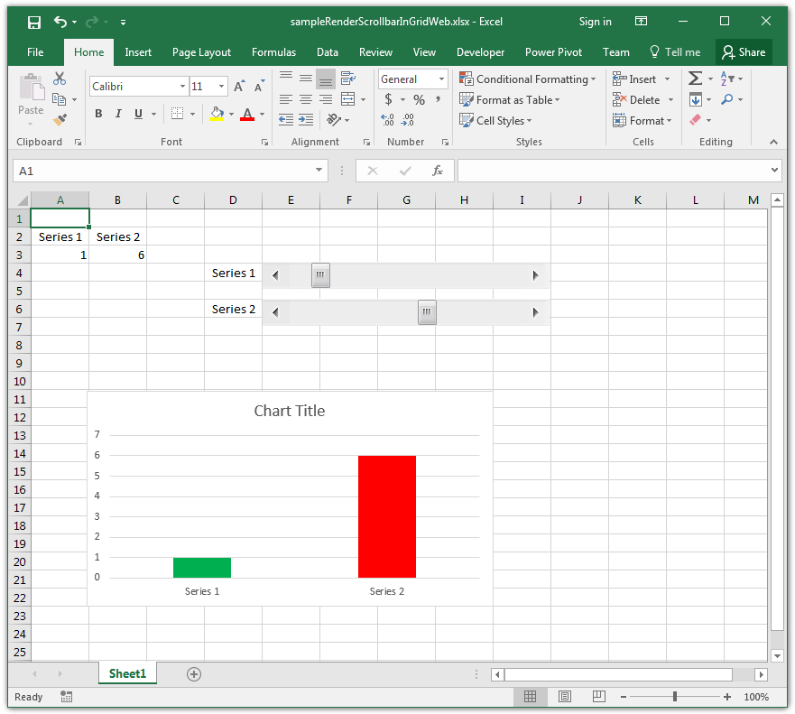
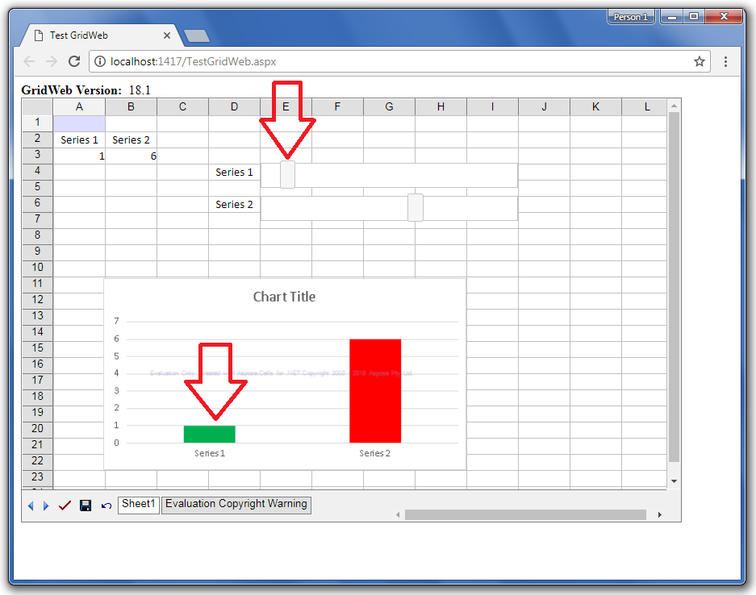
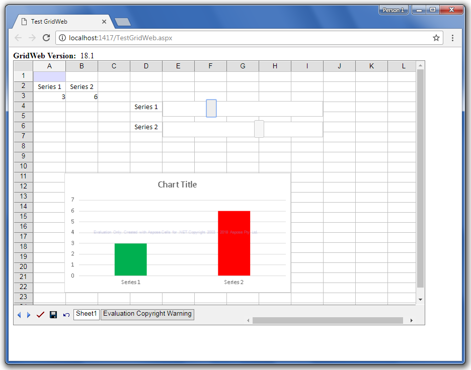
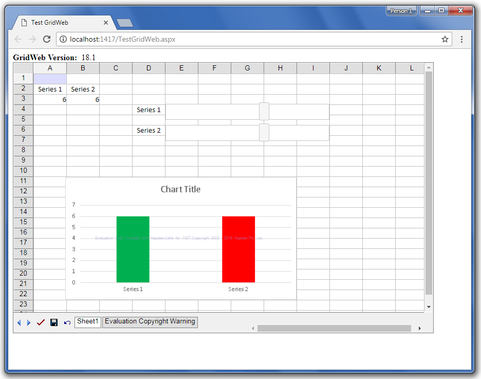

## **Possible Usage Scenarios**
Aspose.Cells for GridWeb can render an interactive scrollbar control inside a GridWeb worksheet. Users can interact with the scrollbar just as they do in Microsoft Excel. In order to create an interactive scrollbar, you must add the links to **jQuery** and **jQuery UI** libraries as shown below.



<head runat="server">

	<link rel="stylesheet" href="/Scripts/jquery-ui.css">

	

	

</head>



## **Render Interactive Scrollbar in GridWeb**
The following sample code loads the [sample Excel file](61767764.xlsx) containing the scrollbar as shown in the screenshot below. The other screenshots show how GridWeb renders an interactive scrollbar and displays its value in cell **B3**. Whenever you scroll the scrollbar, the value of cell **B3** updates accordingly.

## **Sample Code**


<%@ Page Language="C#" AutoEventWireup="true" CodeFile="TestGridWeb.aspx.cs" Inherits="TestGridWeb" %>

<%@ Register TagPrefix="acw" Namespace="Aspose.Cells.GridWeb" Assembly="Aspose.Cells.GridWeb" %>

<!DOCTYPE html PUBLIC "-//W3C//DTD XHTML 1.0 Transitional//EN" "http://www.w3.org/TR/xhtml1/DTD/xhtml1-transitional.dtd">

<html xmlns="http://www.w3.org/1999/xhtml">

<head runat="server">

	<link rel="stylesheet" href="/Scripts/jquery-ui.css">

	

	

	<title>Test GridWeb</title>

</head>

<body>

    <form id="form1" runat="server">

        

            

                <b>GridWeb Version:&nbsp;</b>

                <asp:Label ID="lblVersion" runat="server" Text="Label"></asp:Label>

                 

            

            <acw:GridWeb ID="GridWeb1" runat="server" XhtmlMode="True" Height="504px" Width="1119px">

            </acw:GridWeb>

        

    </form>

</body>

</html>

\--------------------------------------------

\--------------------------------------------

\--------------------------------------------

using System;

using System.Collections;

using System.Configuration;

using System.Data;

using System.Linq;

using System.Web;

using System.Web.Security;

using System.Web.UI;

using System.Web.UI.HtmlControls;

using System.Web.UI.WebControls;

using System.Web.UI.WebControls.WebParts;

using System.Xml.Linq;

using System.IO;

using Aspose.Cells;

using Aspose.Cells.GridWeb.Data;

using Aspose.Cells.GridWeb;

using System.Globalization;

using System.Threading;

using System.Collections.Generic;

public partial class TestGridWeb : System.Web.UI.Page

{

    protected void Page_Load(object sender, EventArgs e)

    {

        if (Page.IsPostBack == false && this.GridWeb1.IsPostBack == false)

        {

            lblVersion.Text = GridWeb.GetVersion();

            string fileName = "sampleRenderScrollbarInGridWeb.xlsx";

            string filePath = Server.MapPath("~/ExcelFile/" + fileName);

            GridWeb1.ImportExcelFile(filePath);

        }

    }

}


