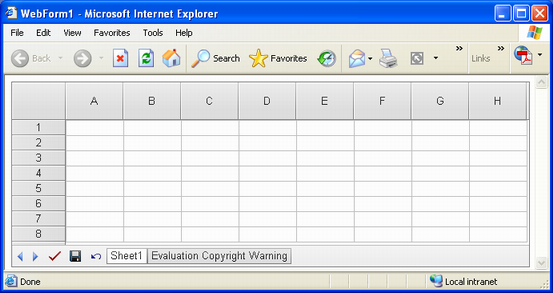

{} 

[Add GridWeb to Web Form](/cells/net/aspose-cells-gridweb/add-gridweb-to-web-form/), discussed resizing the Aspose.Cells.GridWeb control using WYSIWYG. This article explains how to do the same thing but at runtime using the Aspose.Cells.GridWeb API. It also explains how to resize the header bars of the Aspose.Cells.GridWeb control to make their data easier to read.

{} 
## **Changing Width & Height of Aspose.Cells.GridWeb**
Changing the width and height of Aspose.Cells.GridWeb control is a simple but important feature. The Aspose.Cells.GridWeb control is represented by the GridWeb class in the API. To resize the width and height of the GridWeb control, simply use its width and height properties.

{} 

The width and height of the control can be defined in pixels or points.

{} 

The output of the code snippet that follows is shown below.

**Changed width and height of the GridWeb control** 


### **Changing Width & Height of Header Bar**
Aspose.Cells.GridWeb control contains two header bars as follows:

- Top header bar, this header bar represents columns as A , B , C , D etc.
- Left header bar, this header bar represents rows as 1 , 2 , 3 , 4 etc.

Both of these header bars are shown below.

**Header bars** 

Change the height of the top header bar and the width of the left header bar using the GridWeb control's HeaderBarHeight and HeaderBarWidth properties respectively. The figure below shows the output of the code example that follows.

**Changed header bar width and height** 


