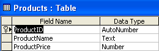
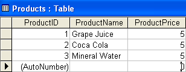

{} 

Data Binding is an exciting feature offered by the Microsoft .NET Framework. We know that the DataGrid control offered by Microsoft supports data binding, which means a DataGrid can be bound to any data source (using DataSet, DataTable, and DataView objects). This feature has made developers' lives a lot easier. Based on the same concept, Aspose.Cells.GridDesktop also supports data binding, which allows developers to bind worksheets to any data source. This article explores the feature.

{} 

## **Creating a Sample Database**
1. Create a sample database to use with the example. We used Microsoft Access to create a sample database with a Products table (schema below). 

1. Three dummy records are added to the Products table.  
   **Records in Products table** 

## **Create a Sample Application**
Now create a simple desktop application in Visual Studio and do the following.

1. Drag the "GridControl" control from the Toolbox and drop it on the form.  
2. Drop four buttons from the Toolbox onto the bottom of the form and set their Text property as **Bind Worksheet**, **Add Row**, **Delete Row**, and **Update to Database** respectively.

## **Adding Namespace and Declaring Global Variables**
Because this example uses a Microsoft Access database, add the `System.Data.OleDb` namespace at the top of the code.



You can now use the classes packaged under this namespace.

1. Declare global variables.



## **Filling DataSet with Data from Database**
Now connect to the sample database to fetch and fill data into a `DataSet` object.

1. Use the `OleDbDataAdapter` object to connect with our sample database and fill a `DataSet` with data fetched from the Products table in the database, as shown in the code below.



## **Binding Worksheet with DataSet**
Bind the worksheet with the Products table of the `DataSet`:

1. Access the desired worksheet.  
2. Bind the worksheet with the `DataSet`'s Products table.

Add the following code to the **Bind Worksheet** button's Click event.



## **Setting Column Headers of Worksheet**
The bound worksheet now loads data successfully, but the column headers are labelled A, B, and C by default. It would be better to set the column headers to the column names in the database table.

To set the column headers of the worksheet:

1. Get the captions for each column of the `DataTable` (Products) in the `DataSet`.  
2. Assign the captions to the headers of worksheet columns.

Append the code written in the **Bind Worksheet** button's Click event with the following code snippet. By doing this, the old column headers (A, B, and C) will be replaced with **ProductID**, **ProductName**, and **ProductPrice**.



## **Customizing the Width and Styles of Columns**
To improve the look of the worksheet further, it is possible to set the width and styles of columns. For example, sometimes the column header or the value inside the column consists of a long string of characters that don't fit inside the cell. To solve such issues, Aspose.Cells.GridDesktop supports changing the widths of columns.

Append the following code to the **Bind Worksheet** button. The column widths will be customized according to the new settings.



Aspose.Cells.GridDesktop also supports applying custom styles to columns. The following code, appended to the **Bind Worksheet** button, customizes the column styles to make them more presentable.



Now run the application and click the **Bind Worksheet** button.

## **Adding Rows**
To add new rows to a worksheet, use the `Worksheet` class `AddRow` method. This appends an empty row at the bottom, and a new `DataRow` is added to the data source (here, a new `DataRow` is added to the `DataSet`'s `DataTable`). Developers can add as many rows as they want by calling the `AddRow` method repeatedly. When a row has been added, users can enter values into it.



## **Deleting Rows**
Aspose.Cells.GridDesktop also supports deleting rows by calling the `Worksheet` class `RemoveRow` method. Removing a row using Aspose.Cells.GridDesktop requires the index of the row to be deleted.



Add the above code to the **Delete Row** button and run the application. A few records are displayed before the row is removed. Selecting a row and clicking the **Delete Row** button removes the selected row.

## **Saving Changes to Database**
Finally, to save any changes made by users to the worksheet back to the database, use the `OleDbDataAdapter` object's `Update` method. The `Update` method takes the data source (DataSet, DataTable, etc.) of the worksheet and updates the database.



1. Add the above code to the **Update to Database** button.  
2. Run the application.  
3. Perform some operations on the worksheet data, such as adding new rows, editing, or removing existing data.  
4. Then click **Update to Database** to save the changes to the database.  
5. Check the database to see that the table records have been updated accordingly.
