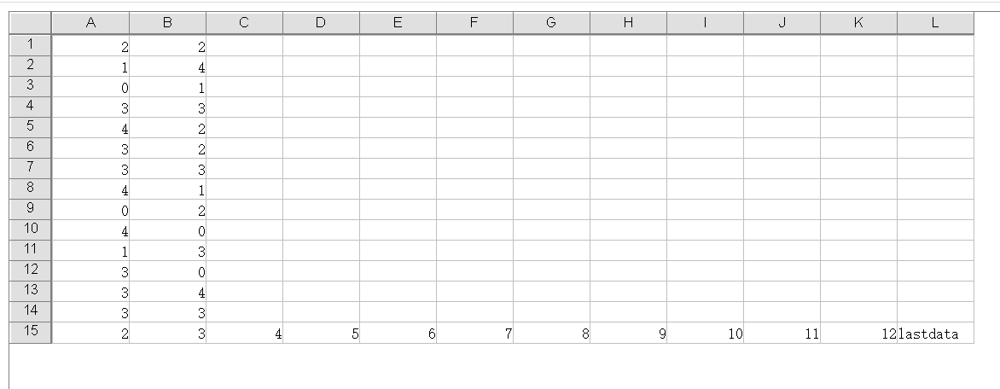
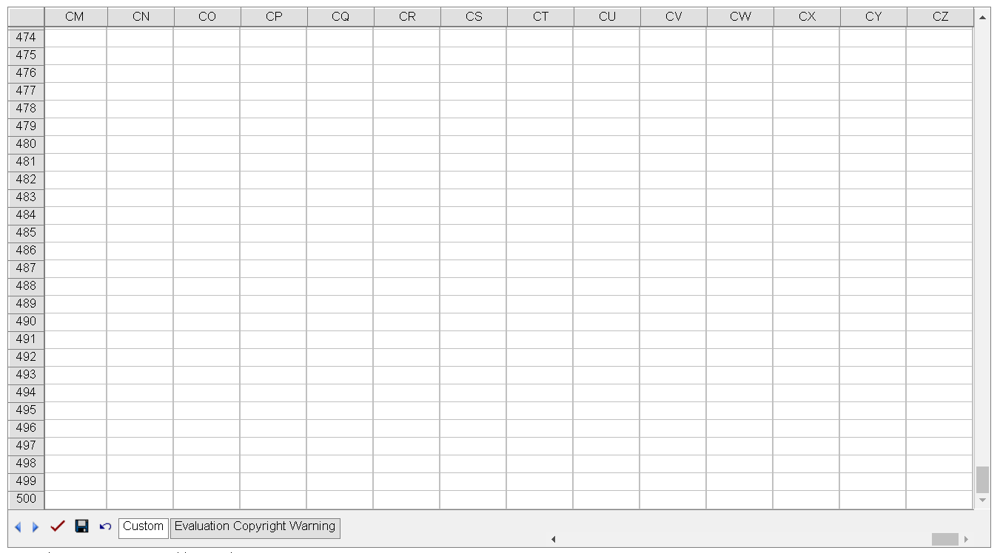

---  
title: Ignore styles to get better performance in GridWeb  
type: docs  
weight: 1060  
url: /net/aspose-cells-gridweb/ignorestylewithnodata  
description: This article describes how to use IgnoreStyleWithNoData to get better performance in GridWeb.  
keywords: GridWeb,performance  
ai_search_scope: cells_net  
ai_search_endpoint: "https://docsearch.api.aspose.cloud/ask"
---  

## **Possible Usage Scenarios**  
Please use the [GridWeb.IgnoreStyleWithNoData](https://reference.aspose.com/cells/net/aspose.cells.gridweb/mainweb/ignorestylewithnodata) property to load fewer rows and columns from the workbook.  

## **Get Better Performance While Loading Workbook**  
Please check the [sample Excel file](largerowswithstyle.xlsx)  

When **IgnoreStyleWithNoData** is set to `true`:

As you can see, it shows rows up to 15 and columns up to L. It will not display the last continuous rows and columns without data in cells. Thus, the load time will be reduced.  

  

When **IgnoreStyleWithNoData** is set to `false` (the default value is false):

As you can see, it shows many more rows (up to 500) and columns (up to CZ).  

From row 16 to row 500, some of the cells have the border style set, however the cells contain no data.  

From column M to column CZ, some of the cells have the border style set, however the cells contain no data.  

  
