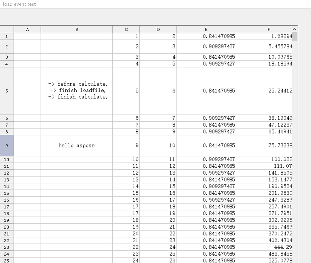

## **Loading event for GridDesktop**
The following sample code illustrates how to use different kinds of loading events for GridDesktop while importing a file. Please check the [sample excel file](loading-event.xlsx).

The file is password protected. First, we try to open it with an incorrect password, then finally, in the FailLoadFile event, we use the correct password to open it.

### **Sample Code**

