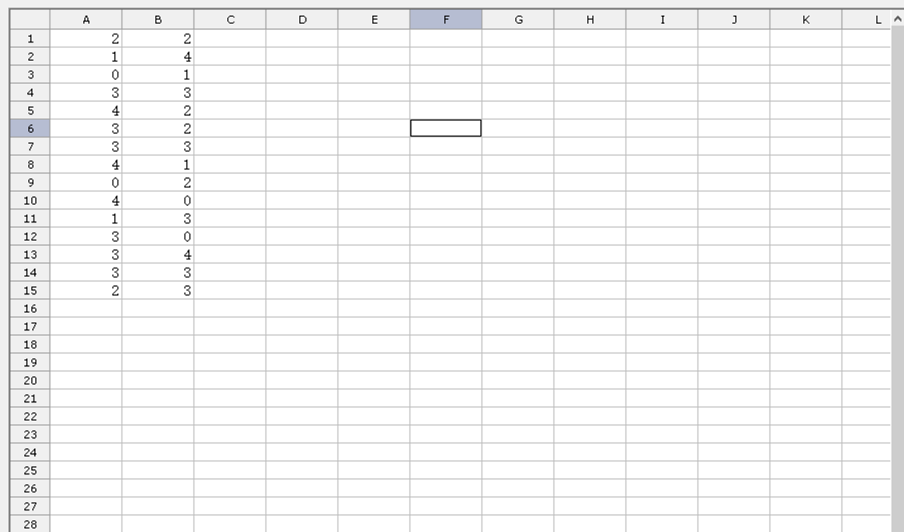

## **Possible Usage Scenarios**
Please use [GridDesktop.LoadDataFilter](https://reference.aspose.com/cells/net/aspose.cells.griddesktop/griddesktop/properties/loaddatafilter) property while filtering data from the workbook.

The [GridLoadDataFilterOptions](https://reference.aspose.com/cells/net/aspose.cells.griddesktop.data/gridloaddatafilteroptions) enumeration has the following values.
- All
- BookSettings
- CellBlank
- CellBool
- CellData
- CellError
- CellNumeric
- CellString
- CellValue
- Chart
- ConditionalFormatting
- DataValidation
- DefinedNames
- DocumentProperties
- Formula
- Hyperlinks
- MergedArea
- PivotTable
- Settings
- Shape
- SheetData
- SheetSettings
- Structure
- Style
- Table
- VBA
- XmlMap

## **Filter data while Loading Workbook**
The following sample code illustrates how to filter drawings from the workbook. Please check the [sample Excel file](5472489.xlsx). As you can see, all charts/shapes/images have been filtered out of the workbook.

### **Sample Code**

