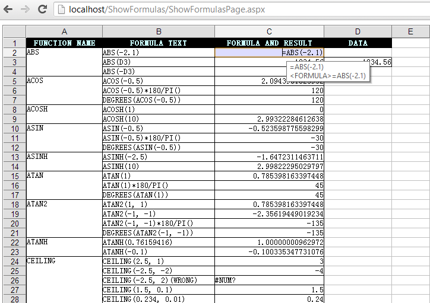
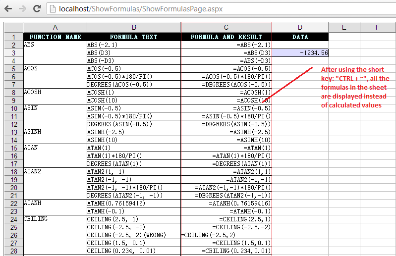

{} 

Sometimes, you need to find an easy way to work with cells containing formulas. You need an approach to quickly read through all formulas to check for errors. This can help you trace the data being used in a formula.

Aspose.Cells.GridWeb provides the feature called Show Formulas in Microsoft Excel.

{} 
## **Using Show Formulas Feature**
All you need is to use the shortcut "CTRL + ~" to display all the formulas in the worksheet.

For example, we load a template file into the GridWeb which has formulas in the C column. Here is the code we simply used to load the file.



The file is loaded into the GridWeb, and we can see a sheet with all the values in the picture below.

After pressing CTRL + ~, all formulas are displayed.

