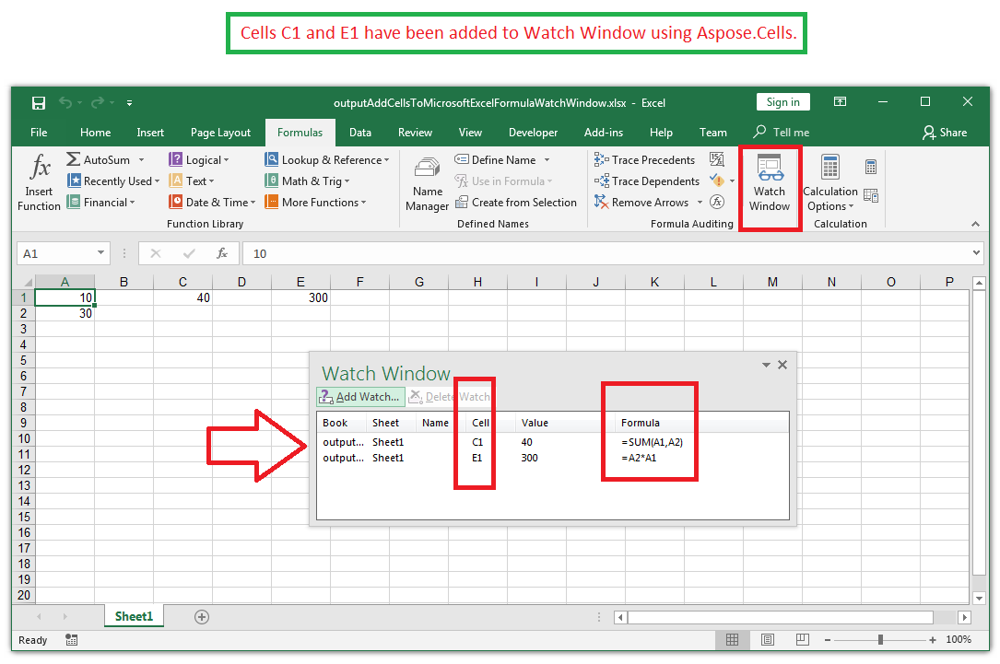

## **Possible Usage Scenarios**

Microsoft Excel Watch Window is a useful tool to watch cell values and their formulas conveniently in a window. You can open the *Watch Window* in Microsoft Excel by clicking **Formulas > Watch Window**. It has the *Add Watch* button that can be used to add cells for inspection. Similarly, you can use the [**Worksheet.CellWatches.Add()**](https://reference.aspose.com/cells/net/aspose.cells/cellwatchcollection/methods/add/index) method to add cells into the *Watch Window* using the Aspose.Cells API.

## **Add Cells to Microsoft Excel Formula Watch Window**

The following sample code sets the formulas of cells C1 and E1 and adds both of them to the Watch Window. It then saves the workbook as the [output Excel file](67338481.xlsx). If you open the output Excel file and view the *Watch Window*, you will see both cells as shown in this screenshot.

## **Sample Code**



