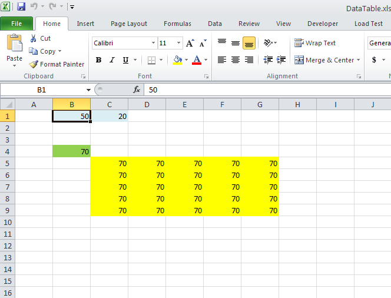

{}

You can create Data Table in Microsoft Excel using Data > What-If Analysis > Data Table.... Aspose.Cells now allows you to calculate the array formula of a data table. Please use [**Workbook.CalculateFormula()**](https://reference.aspose.com/cells/net/aspose.cells/workbook/methods/calculateformula) as normal for calculating any type of formulas.

{}

In the following sample code, we used the [source excel file](5115535.xlsx). If you change the value of cell B1 to 100, the values of the Data Table which are filled with Yellow color will become 120 as shown in the following images. The sample code generates the [output PDF](5115538.pdf).

Here is the sample code used to generate the [output PDF](5115538.pdf) from the [source excel file](5115535.xlsx). Please read the comments for more information.



