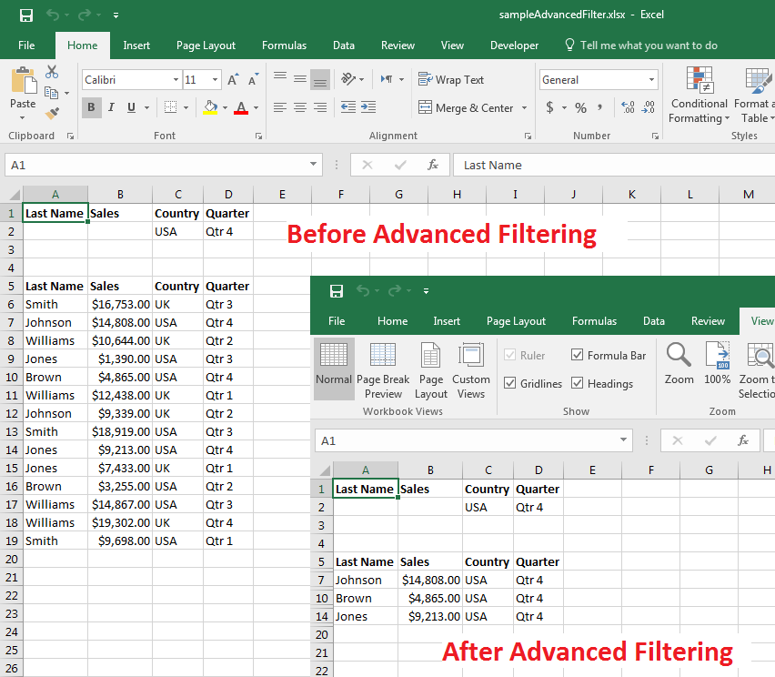

## **Possible Usage Scenarios**

Microsoft Excel allows you to apply *Advanced Filter* on worksheet data to display records that meet complex criteria. You can apply Advanced Filter with Microsoft Excel via its *Data > Advanced* command as shown in this screenshot.

Aspose.Cells also allows you to apply the Advanced Filter using the [**Worksheet.AdvancedFilter()**](https://reference.aspose.com/cells/net/aspose.cells/worksheet/methods/advancedfilter) method. Just like Microsoft Excel, it accepts the following parameters.

**isFilter**  
Indicates whether to filter the list in place.

**listRange**  
The list range.

**criteriaRange**  
The criteria range.

**copyTo**  
The range to copy the data to.

**uniqueRecordOnly**  
Indicates whether to display or copy only unique rows.

## **Apply Advanced Filter of Microsoft Excel to Display Records Meeting Complex Criteria**

The following sample code applies the Advanced Filter to the [Sample Excel File](48496692.xlsx) and generates the [Output Excel File](48496691.xlsx). The screenshot shows both files for comparison. As you can see in the screenshot, data has been filtered in the output Excel file according to complex criteria.

## **Sample Code**



