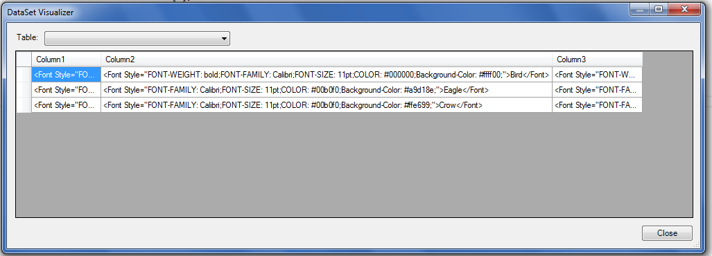

## **Possible Usage Scenarios**
Using Aspose.Cells APIs, developers can fill a DataTable with corresponding HTML strings (based on cell values) while exporting worksheet data. This document explains how to export HTML strings for the formatted cell data to fill a DataTable using Aspose.Cells APIs.

## **Export HTML String Value of the Cells to the DataTable**
The following sample code illustrates how to export HTML string values of the cells to a DataTable while exporting data from the worksheet into the DataTable. Please see the [sample Excel file](45056025.xlsx), its screenshot, and the console output for reference.

## **Screenshot**

## **Sample Code**


## **Console Output**


 Crow



