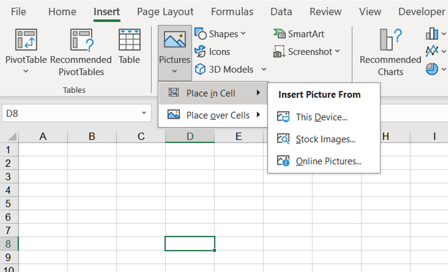
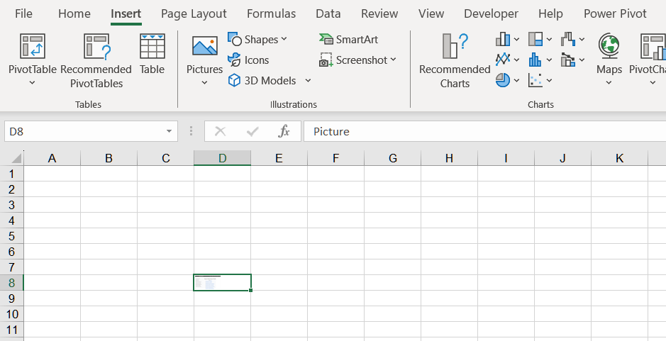
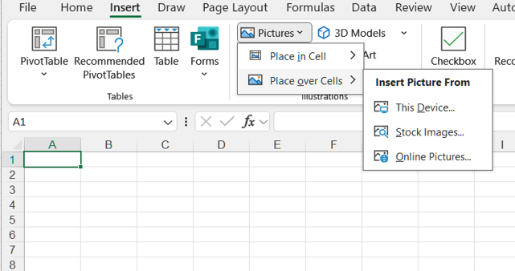
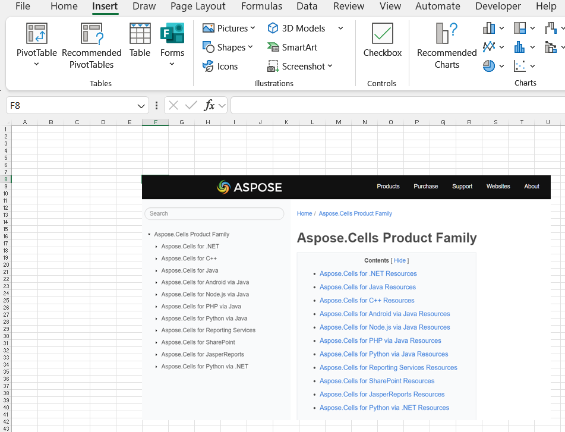
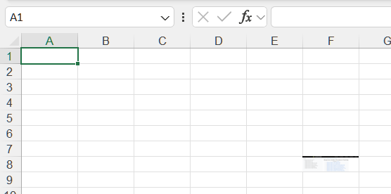

## **Why Fitting Image to Cell Width and Height**
Fitting an image to a specific cell's width and height isn't just about aesthetics. It's fundamentally about precision, automation, and data organization.

1. For Professional Presentation and Readability: When building a dashboard, you often need icons, flags, or product images to align perfectly with data points. A misaligned image looks sloppy and unprofessional.If you're designing a template for others to use (e.g., a product catalog, an employee directory), you want the images to automatically fit into the designated spaces, ensuring consistency every time the template is used. Images that overflow cells can cause unexpected page breaks and formatting issues when printing. A fitted image behaves predictably on the printed page.

2. For Data Organization and Structure: This is the most crucial functional reason. Excel is a grid for data. When an image is "placed" on the grid rather than "fitted" to a cell, it causes problems. Problem with Free-Floating Images: They Don't Move with Cells: If you sort, filter, or insert/delete rows, the image stays in its absolute position on the sheet, completely disconnecting from the data it's supposed to represent. They Don't Resize with Cells: If you change the row height or column width, a free-floating image remains the same size, breaking the layout. Benefit of Fitting to a Cell: The Cell becomes the Image's "Container": When an image is fitted to a cell, its position and size are defined by the cell's grid coordinates. If you move the data (e.g., sort a table), the image moves with its corresponding row. It Creates a True Picture-Data Pair: This allows you to treat the image as a visual attribute of the data in that row, which is essential for automation.

3. For Automation and Advanced Functionality: This is where fitting images to cells becomes a superpower. Linking Images Dynamically: You can use a formula to pull an image path from a cell and then use a macro (VBA) to automatically size and insert the image into an adjacent cell. This is how you create a dynamic product catalog where changing a product ID automatically updates the name, price, and picture.Database Integration: When exporting data or linking Excel to a database, having images contained within specific cells makes the entire dataset, including its visuals, more structured and portable.

## **How to Fit Image to Cell Width and Height Using Excel**
You can fit the image to the cell width and height in Excel using the following two ways.

### **Fit Image to Cell Width and Height Using Place in Cell**
About how to insert a picture into a cell in Excel, follow these steps:

1. Go to the Insert tab and click on the Pictures option.
2. Select **Place in Cell**. Select one of the following sources from the Insert Picture From dropdown menu(**This Device**, **Stock Images** and **Online Pictures**). This Device for inserting picture from your device. Stock Images for inserting picture from stock images. Online Pictures for inserting picture from the web.
 

3. Select picture and insert picture to a cell.
 

### **Fit Image to Cell Width and Height Using Place over Cells**
About how to insert a picture over cells in Excel, follow these steps:

1. Go to the Insert tab and click on the Pictures option.
2. Select **Place over Cells**. Select one of the following sources from the Insert Picture From dropdown menu(**This Device**, **Stock Images** and **Online Pictures**). This Device for inserting picture from your device. Stock Images for inserting picture from stock images. Online Pictures for inserting picture from the web.
 

3. Select picture and insert picture over cells.
 

4. Manually adjust the width and height of the image to match the width and height of the cells.
 

## **How to Fit Image to Cell Width and Height Using Aspose.Cells**
Due to variations in the width and height of rows and columns depending on language and display ratio, adjusting the width and height of an image may result in slight differences, and sometimes may not be completely consistent with the width and height of the cells. You can fit the image to the cell width and height in Aspose.Cells using the following two ways.

### **How to Fit Image to Cell Width and Height Using Place in Cell**
Insert Picture in Cell using Aspose.Cells. Please see the following sample code. After executing the example code, a picture will be inserted into a cell.
1. Instantiate an Workbook object. 
2. Get the cell where you want to insert the picture.
3. Set Cell.EmbeddedImage property. 
4. Finally, it saves the workbook in [output XLSX](out.xlsx) format. 

### **Sample Code for Place in Cell**




### **How to Fit Image to Cell Width and Height Using Place over Cells**
Adding pictures to a spreadsheet is very easy. It only takes a few lines of code:
Simply call the [**Add**](https://reference.aspose.com/cells/net/aspose.cells.drawing/picturecollection/methods/add/index) method of the [**Pictures**](https://reference.aspose.com/cells/net/aspose.cells.drawing/picturecollection) collection (encapsulated in the [**Worksheet**](https://reference.aspose.com/cells/net/aspose.cells/worksheet) object). Then adjust the width and height of the image based on the width and height of the cells. Finally, save the file to [output XLSX](out_net.xlsx) format. The [**Add**](https://reference.aspose.com/cells/net/aspose.cells.drawing/picturecollection/methods/add/index) method takes the following parameters:

- **Upper left row index**, the index of the upper left row.
- **Upper left column index**, the index of the upper left column.
- **Image file name**, the name of the image file, complete with path.

### **Sample Code for Place over Cells**


