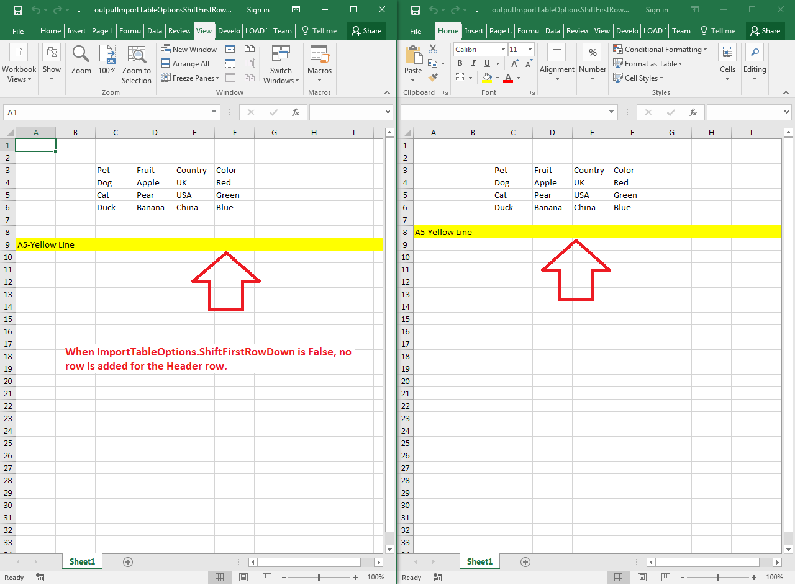

## **Possible Usage Scenarios**

Aspose.Cells allows you to shift the first row down when inserting a table into the worksheet. This document explains how you may accomplish the task using Aspose.Cells APIs.

## **Shift First Row down when inserting Cells Data Table Rows**

The following sample code illustrates how to shift the first row down when inserting a table into the worksheet. We use a simple template Excel file in code to demonstrate the feature. You can exercise the feature by setting the boolean [**ImportTableOptions.ShiftFirstRowDown**](https://reference.aspose.com/cells/net/aspose.cells/importtableoptions/properties/shiftfirstrowdown) attribute to **True**/**False** to better understand it. Please see the [sample Excel file](45056031.xlsx), [output Excel False file](45056032.xlsx), and [output Excel True file](45056033.xlsx) for your reference.

## **Screenshot**

## **Sample Code**


