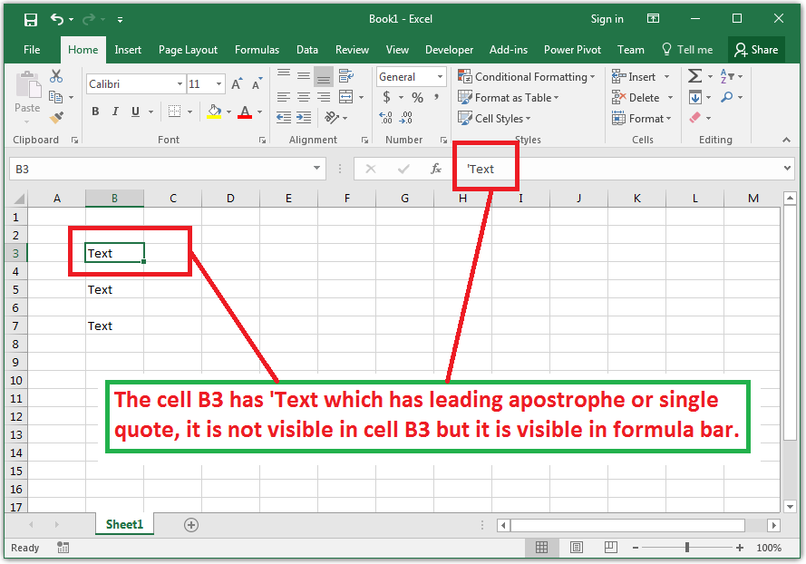

## **Possible Usage Scenarios**

When you put a value inside a cell that has a leading apostrophe or single‑quote mark, Microsoft Excel hides it, but when you select the cell, it displays the leading apostrophe or single quote in the formula bar, as shown in the following screenshot.

Aspose.Cells also hides the leading apostrophe or single quote like Microsoft Excel, but it sets the [**Style.QuotePrefix**](https://reference.aspose.com/cells/net/aspose.cells/style/properties/quoteprefix) as **true** for that cell. If you set an empty style for the cell, then [**Style.QuotePrefix**](https://reference.aspose.com/cells/net/aspose.cells/style/properties/quoteprefix) becomes **false** again. To deal with this issue, Aspose.Cells provides the [**StyleFlag.QuotePrefix**](https://reference.aspose.com/cells/net/aspose.cells/styleflag/properties/quoteprefix) property. When it is set to **false**, the [**Style.QuotePrefix**](https://reference.aspose.com/cells/net/aspose.cells/style/properties/quoteprefix) is not updated at all, and its old value is preserved. This means that if the old value of the [**Style.QuotePrefix**](https://reference.aspose.com/cells/net/aspose.cells/style/properties/quoteprefix) property was **true**, it will remain **true**, and if the old value was **false**, it will remain **false**.

## **Preserve Single Quote Prefix of Cell Value or Range**

The following sample code explains the usage of the [**StyleFlag.QuotePrefix**](https://reference.aspose.com/cells/net/aspose.cells/styleflag/properties/quoteprefix) property as described previously. Please read the comments inside the code and see the console output of the code given below for additional guidance.

## **Sample Code**



## **Console Output**



Quote Prefix of Cell A1: False

Quote Prefix of Cell A1: True

When StyleFlag.QuotePrefix is False, it means, do not update the value of Cell.Style.QuotePrefix.

Similarly, when StyleFlag.QuotePrefix is True, it means, update the value of Cell.Style.QuotePrefix.

Quote Prefix of Cell A1: True

Quote Prefix of Cell A1: False



