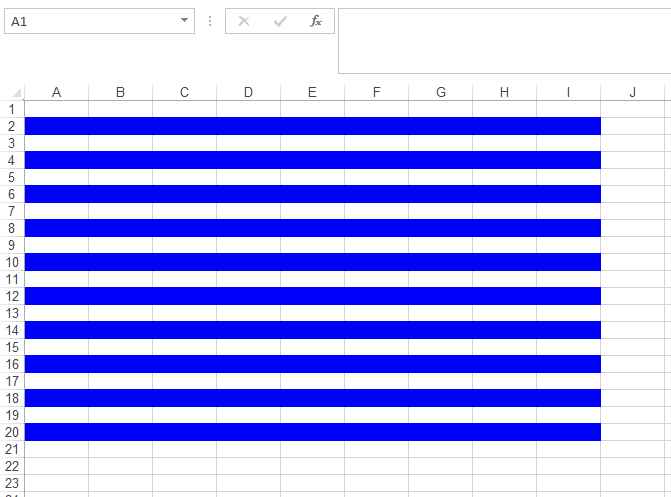

{}

Aspose.Cells APIs provide the means to add and manipulate conditional formatting rules for the [**Worksheet**](https://reference.aspose.com/cells/net/aspose.cells/worksheet) object. These rules can be tailored in a number of ways to get the desired formatting based on conditions.

{}

This article makes use of Excel's built-in functions such as ROW, COLUMN, and MOD. Here are some details of these functions for a better understanding of the code snippet provided ahead.

- **ROW()** function returns the row number of a cell reference. If the reference parameter is omitted, it assumes that the reference is the cell address in which the ROW function has been entered.
- **COLUMN()** function returns the column number of a cell reference. If the reference parameter is omitted, it assumes that the reference is the cell address in which the COLUMN function has been entered.
- **MOD()** function returns the remainder after a number is divided by a divisor, where the first parameter to the function is the numeric value whose remainder you wish to find and the second parameter is the number used to divide into the number parameter. If the divisor is 0, it will return the #DIV/0! error.

Let's start writing some code to accomplish this goal with the help of Aspose.Cells for .NET API.



The following snapshot shows the resultant spreadsheet loaded in the Excel application.

||
| :- |

In order to apply the shading to alternate columns, all you have to do is change the formula **=MOD(ROW(),2)=0** to **=MOD(COLUMN(),2)=0**, that is, instead of getting the row index, modify the formula to retrieve the column index.  
The resultant spreadsheet, in this case, will look as follows.

||
| :- |

