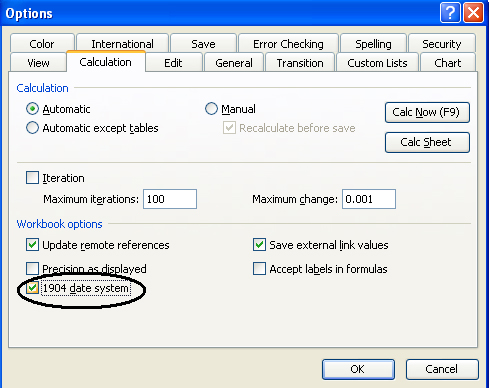

{} 

Microsoft Excel supports two date systems: the 1900 date system (the default date system implemented in Excel for Windows) and the 1904 date system. The 1904 date system is normally used to provide compatibility with Macintosh Excel files and is the default system if you are using Excel for Macintosh. You can set the 1904 date system for Excel files using Aspose.Cells.

{} 

To implement the 1904 date system in Microsoft Excel (for example, Microsoft Excel 2003):

1. From the **Tools** menu, select **Options**, and select the **Calculation** tab.  
2. Select the **1904 date system** option.  
3. Click **OK**.  

|**Selecting 1904 date system in Microsoft Excel**|
| :- |
||

See the following sample code for how to achieve this using Aspose.Cells APIs.



