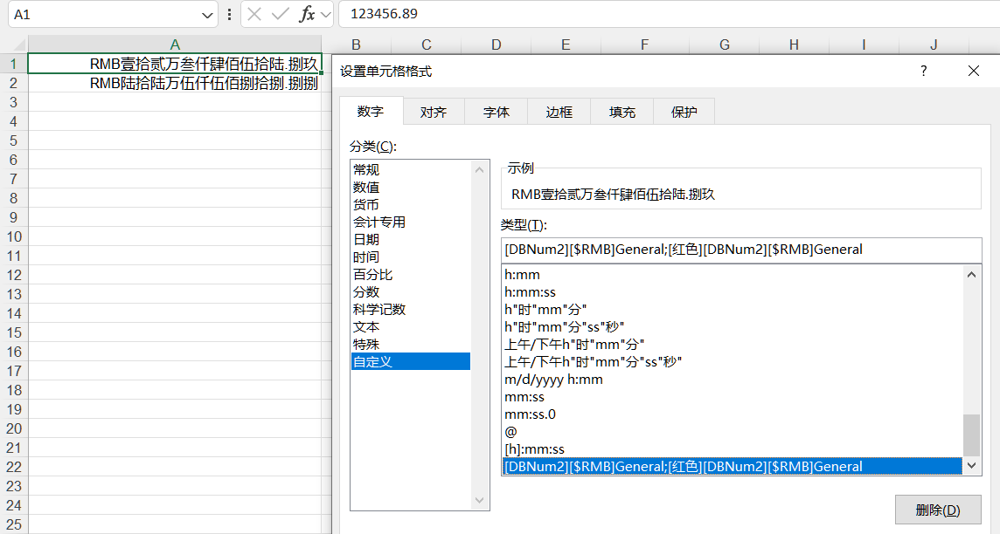
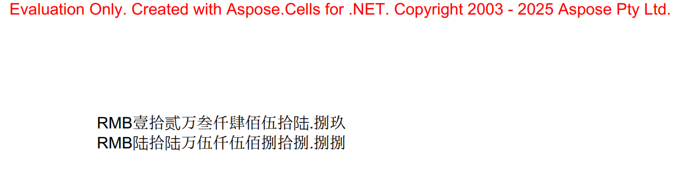

## **Possible Usage Scenarios**

Formatting numbers to local formats in Excel is essential for ensuring that data is clearly understood, accurately interpreted, and professionally presented across different regions and cultures.

1. **Cultural and Regional Adaptation**: Different regions use various number formats for decimals, thousands separators, currencies, and dates. 
1. **Professionalism and Clarity**: Using local formats enhances the professional appearance of your spreadsheets. It shows attention to detail and consideration for the audience, which is crucial in reports, financial statements, and data shared with stakeholders.
1. **Consistency in Data Display**: Local formatting ensures consistency when collaborating with teams or clients from different regions. It prevents errors that might arise from misinterpretation of data, such as confusing decimal separators.
1. **Compatibility with External Systems**: When exporting data to other formats (e.g., CSV), local formatting can help maintain data integrity.
1. **Accessibility and User-Friendliness**: Local formatting makes data more accessible to users who are unfamiliar with foreign formats. For example, displaying dates in the format "DD/MM/YYYY" (common in the UK) vs. "MM/DD/YYYY" (common in the US) avoids confusion.
1. **Data Validation and Accuracy**: Incorrect formatting can lead to calculation errors. For example, if a number is misinterpreted due to decimal separator issues, formulas may produce wrong results. Using local formats ensures that data entered by users aligns with regional standards, reducing the risk of errors during data input or analysis.

## **How to Format Number to Local Language Format in Excel**

To format numbers to local language format in Excel, you can utilize various built-in features and functions that adapt to different regional settings. 

1. **Use Excel's Built-in Locale Settings**: Go to File > Options > Regional Settings (or similar, depending on your Excel version). Select your desired language/region (e.g., German for comma decimal separators, English for period separators). Existing values and formulas will automatically convert to the new format.
1. **Use the TEXT Function for Custom Localized Formatting**: The TEXT function can force number formatting based on locale-specific patterns, useful for displaying numbers like phone numbers or currency without altering global settings. Syntax: =TEXT(value, "format_code").
1. **Programmatic Handling (VBA/APIs)**: For developers using VBA, you can use NumberFormat with US English format strings (e.g., "#.##"). Excel will automatically adapt to the user's locale settings. Avoid NumberFormatLocal unless explicitly needing locale-specific format strings.
1. **Override System Separators for Specific Cases**: If localized formatting behaves unexpectedly (e.g., due to Windows updates affecting separators), manually override defaults: In Excel options, uncheck "Use system separators" and define custom decimal/thousands separators.
1. **Format Number Using Custom Format**: Right click on the cell, select 'Format Cells', then find 'Number'->'Custom' and set the desired custom number type. Taking setting custom number formats in a Chinese environment as an example.
 

## **How to Format Number to Local Language Format in Aspose.Cells for .NET**

To format numbers to local language format in Aspose.Cells for .NET, you can use the `Style` object associated with a cell or range of cells. The `Style` object allows you to set various formatting options, including custom number format. 

Here's a basic example of how to apply an local language number format to a cell in Aspose.Cells for .NET:

1. **Reference Aspose.Cells**: Make sure you have Aspose.Cells for .NET referenced in your project. You can obtain it from NuGet or the Aspose website.

2. **Create or Open a Workbook**: You start by creating a new workbook or opening an existing one.

3. **Access the Desired Cell**: Identify and access the cell or range of cells you want to format.

4. **Apply Custom Number Format**: Set the number format of the cell's style to an chinese language number format.

4. **Sample Code**: Here's a code snippet demonstrating these steps.



## **Output generated by the sample code**
Here is the pdf result of the above sample code.
 


