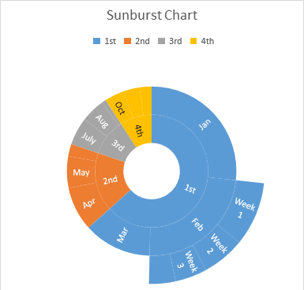

## **Possible Usage Scenarios**
Treemap charts are good for comparing proportions within the hierarchy, however, treemap charts aren't great at showing hierarchical levels between the largest categories and each data point. A sunburst chart is a much better visual chart for showing that.The sunburst chart is ideal for displaying hierarchical data. Each level of the hierarchy is represented by one ring or circle with the innermost circle as the top of the hierarchy. A sunburst chart without any hierarchical data (one level of categories), looks similar to a doughnut chart. However, a sunburst chart with multiple levels of categories shows how the outer rings relate to the inner rings. The sunburst chart is most effective at showing how one ring is broken into its contributing pieces, while another type of hierarchical chart, the treemap chart, is ideal for comparing relative sizes.

## **Sunburst chart**
After running the code below, you will see the Sunburst chart as shown below.

## **Sample Code**
The following sample code loads the [sample Excel file](sunburst.xlsx) and generates the [output Excel file](out.xlsx).


