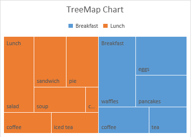

## **Possible Usage Scenarios**
A treemap chart provides a hierarchical view of your data and makes it easy to spot patterns, such as which items are the store's best sellers. **The** tree branches are represented by rectangles, and each sub‑branch is shown as a smaller rectangle. The treemap chart displays categories by color and proximity, and can easily show large amounts of data that would be difficult to present with other chart types.

## **TreeMap chart**
After running the code below, you will see the TreeMap chart as shown below.

## **Sample Code**
The following sample code loads the [sample Excel file](treemap.xlsx) and generates the [output Excel file](out.xlsx).



