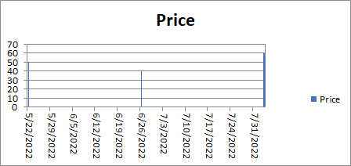

## **Possible Usage Scenarios**
When you create a chart from worksheet data that uses dates and the dates are plotted along the horizontal (category) axis in the chart, Aspose.Cells automatically changes the category axis to a date (time‑scale) axis.  
A date axis displays dates in chronological order at specific intervals or base units, such as the number of days, months, or years, even if the dates on the worksheet are not in sequential order or in the same base units.  
By default, Aspose.Cells determines the base units for the date axis based on the smallest difference between any two dates in the worksheet data. For example, if you have data for stock prices where the smallest difference between dates is seven days, Excel sets the base unit to days, but you can change the base unit to months or years if you want to see the performance of the stock over a longer period of time.

## **Handle Date Axis like Microsoft Excel**
Please see the following sample code that creates a new Excel file and puts the values of the chart in the first worksheet.  
Then we add a chart, set its Axis type to **TimeScale**, and set the base units to **Days**.

## **Sample Code**


