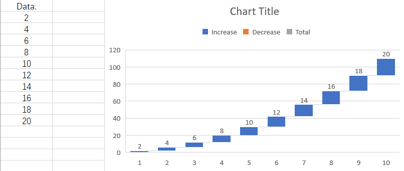

## **Possible Usage Scenarios**

Aspose.Cells APIs have exposed the [**ChartGlobalizationSettings**](https://reference.aspose.com/cells/net/aspose.cells.charts/chartglobalizationsettings/) class in order to deal with scenarios where the user wishes to set chart components to a different language. It also supports custom labels for subtotals in a spreadsheet. 

## **Introduction to ChartGlobalizationSettings Class**

The [**ChartGlobalizationSettings**](https://reference.aspose.com/cells/net/aspose.cells.charts/chartglobalizationsettings/) class currently offers the following eight methods which can be overridden in a custom class to translate items such as Axis title name, Axis unit name, Chart title name, etc., into different languages.

1. [**GetAxisTitleName**](https://reference.aspose.com/cells/net/aspose.cells.charts/chartglobalizationsettings/getaxistitlename/): Gets the name of the title for an axis.  
2. [**GetAxisUnitName**](https://reference.aspose.com/cells/net/aspose.cells.charts/chartglobalizationsettings/getaxisunitname/): Gets the name of the axis unit.  
3. [**GetChartTitleName**](https://reference.aspose.com/cells/net/aspose.cells.charts/chartglobalizationsettings/getcharttitlename/): Gets the name of the chart title.  
4. [**GetLegendDecreaseName**](https://reference.aspose.com/cells/net/aspose.cells.charts/chartglobalizationsettings/getlegenddecreasename/): Gets the name of “Decrease” for the legend.  
5. [**GetLegendIncreaseName**](https://reference.aspose.com/cells/net/aspose.cells.charts/chartglobalizationsettings/getlegendincreasename/): Gets the name of “Increase” for the legend.  
6. [**GetLegendTotalName**](https://reference.aspose.com/cells/net/aspose.cells.charts/chartglobalizationsettings/getlegendtotalname/): Gets the name of “Total” for the legend.  
7. [**GetOtherName**](https://reference.aspose.com/cells/net/aspose.cells.charts/chartglobalizationsettings/getothername/): Gets the name of the “Other” label for the chart.  
8. [**GetSeriesName**](https://reference.aspose.com/cells/net/aspose.cells.charts/chartglobalizationsettings/getseriesname/): Gets the name of a series in the chart.  

### **Custom language translation**
Here, we will create a waterfall chart based on the following data. The names of chart components will be displayed in English in the chart. We will use a Turkish language example to show how to display the Chart Title, Legend Increase/Decrease names, Total name, and Axis Title in Turkish.

## **Sample Code**
The following sample code loads the [sample Excel file](waterfall.xlsx).



## Output generated by the sample code

This is the console output of the above sample code.


Workbook chart title: Grafik Başlığı

Workbook chart legend: Artış

Workbook chart legend: Düşüş

Workbook chart legend: Toplam

Workbook category axis title: Eksen Başlığı


