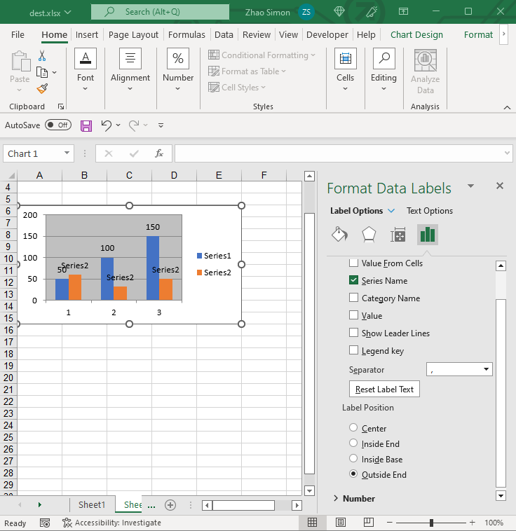

{}

DataLabels are an important part of a chart.  
We can easily see the value, percentage, etc., of each series.

{}

## **DataLabels Options**
Aspose.Cells also allows you to manage a chart's DataLabels at runtime. With the [DataLabels](https://reference.aspose.com/cells/net/aspose.cells.charts/datalabels/) object, it's simple to move, update, and format the chart's DataLabels.

||

## **Manage the DataLabels of a Chart**
It's simple to manage the chart's DataLabels with Aspose.Cells [DataLabels](https://reference.aspose.com/cells/net/aspose.cells.charts/datalabels/).

The following code snippet demonstrates how to manage DataLabels:



Often you need the data labels to show values, percentages, or custom-formatted numbers directly on the chart. With Aspose.Cells you can programmatically:

* Enable data labels for a series.
* Apply font, color, and background settings to data labels.
* Set a custom numeric format (e.g., currency, percentage, custom date/time).
* Override the formatting of a single point's data label.

The following sections demonstrate these tasks with complete, ready-to-run C# code samples.

---

## **Formatting Data Labels for a Series**
**Creating a Chart and Enabling Series Data Labels**
The example below creates a simple column chart, adds a data series, turns on data labels for the whole series, and applies a custom number format and styling.

```csharp
// For complete examples and data files, please go to https://github.com/aspose-cells/Aspose.Cells-for-.NET
using System;
using System.Drawing;
using Aspose.Cells;
using Aspose.Cells.Charts;

namespace AsposeCellsChartDataLabelDemo
{
    class Program
    {
        static void Main()
        {
            // Path to the directory where output will be saved.
            string dataDir = "./";

            // Ensure the directory exists.
            if (!System.IO.Directory.Exists(dataDir))
                System.IO.Directory.CreateDirectory(dataDir);

            // 1. Create a new workbook and get the first worksheet.
            Workbook workbook = new Workbook();
            Worksheet sheet = workbook.Worksheets[0];

            // 2. Populate some sample data that will be used by the chart.
            //    A1:A5 - Categories, B1:B5 - Values.
            sheet.Cells["A1"].PutValue("Q1");
            sheet.Cells["A2"].PutValue("Q2");
            sheet.Cells["A3"].PutValue("Q3");
            sheet.Cells["A4"].PutValue("Q4");
            sheet.Cells["A5"].PutValue("Q5");

            sheet.Cells["B1"].PutValue(12000);
            sheet.Cells["B2"].PutValue(15000);
            sheet.Cells["B3"].PutValue(18000);
            sheet.Cells["B4"].PutValue(13000);
            sheet.Cells["B5"].PutValue(17000);

            // 3. Add a column chart to the worksheet.
            int chartIndex = sheet.Charts.Add(ChartType.Column, 7, 0, 22, 10);
            Chart chart = sheet.Charts[chartIndex];

            // 4. Add a series that uses the data we entered.
            int seriesIndex = chart.NSeries.Add("B1:B5", true);
            // Set the category (X) axis labels.
            chart.NSeries.CategoryData = "A1:A5";

            // 5. Enable value, CategoryName of data labels for the whole series.
            chart.NSeries[seriesIndex].DataLabels.ShowValue = true;
            chart.NSeries[seriesIndex].DataLabels.ShowCategoryName = true;

            // 6. Access the data label object to apply formatting.
            DataLabels label = chart.NSeries[seriesIndex].DataLabels;
            // Show the actual value.
            label.ShowValue = true;
            // Set a custom number format - currency with no decimal places.
            label.NumberFormat = "\"$\"#,##0";

            // 7. Apply font styling.
            label.Font.Color = Color.DarkBlue;
            label.Font.Size = 12;
            label.Font.IsBold = true;
            label.Font.Name = "Arial";

            // 8. Save the workbook.
            workbook.Save(dataDir + "SeriesDataLabels.xlsx");
        }
    }
}
```

**Key Points**

* `NumberFormat` follows the same pattern as Excel's custom number-format strings.

---

## **Formatting a Data Label for an Individual Point**
Sometimes a single point needs a different label (e.g., highlighting a peak value). The code below demonstrates how to locate a specific point and customize its label independently of the series settings.

```csharp
using System;
using System.Drawing;
using Aspose.Cells;
using Aspose.Cells.Charts;

namespace AsposeCellsPointLabelDemo
{
    class Program
    {
        static void Main()
        {
            string dataDir = "./";
            if (!System.IO.Directory.Exists(dataDir))
                System.IO.Directory.CreateDirectory(dataDir);

            // Create a workbook with the same data as the previous example.
            Workbook wb = new Workbook();
            Worksheet ws = wb.Worksheets[0];

            // Populate data.
            string[] categories = { "Jan", "Feb", "Mar", "Apr", "May" };
            double[] values = { 5000, 8000, 12000, 9000, 15000 };
            for (int i = 0; i < categories.Length; i++)
            {
                ws.Cells[i, 0].PutValue(categories[i]); // A column
                ws.Cells[i, 1].PutValue(values[i]);    // B column
            }

            // Add a line chart.
            int chartIdx = ws.Charts.Add(ChartType.Line, 7, 0, 22, 10);
            Chart chart = ws.Charts[chartIdx];
            int seriesIdx = chart.NSeries.Add("B1:B5", true);
            chart.NSeries.CategoryData = "A1:A5";

            // Show data labels for the whole series (default formatting).
            chart.NSeries[seriesIdx].DataLabels.ShowValue = true;

            // ----- Customising the data label for the 3rd point (index 2) -----
            // Access the specific point in the series.
            ChartPoint point = chart.NSeries[seriesIdx].Points[2]; // March value

            // Enable a data label only for this point.
            point.DataLabels.ShowValue = true;
            // Enable the CategoryName for March value
            point.DataLabels.ShowCategoryName = true;
            DataLabels pointLabel = point.DataLabels;

            // Set a percentage format (example purpose).
            pointLabel.NumberFormat = "0.0%"; // Displays as 0.0%

            // Apply distinct styling to make it stand out.
            pointLabel.Font.Color = Color.Red;
            pointLabel.Font.IsBold = true;
            pointLabel.Font.Size = 14;
            pointLabel.Font.Name = "Calibri";

            // Optional: add a custom text instead of the value.
            pointLabel = chart.NSeries[seriesIdx].Points[3].DataLabels; //Apr point
            pointLabel.ShowValue = false; // Hide original value

            // Save the result.
            wb.Save(dataDir + "PointDataLabel.xlsx");
        }
    }
}
```

**Important Notes**

* Each `ChartPoint` has its own `DataLabel` object; you can enable it independently of the series label.
* Number formats such as `"0%"`, `"\$"#,##0.00`, or `"mm/dd/yyyy"` are fully supported.

## **About the NumberFormatLinked attribute of the DataLabels**
**Important Notes**
* The default value of `DataLabels.NumberFormatLinked` is True, this attribute describes if the number format is linked to the cells. 
But for chart types after Excel 2016 (e.g., Waterfall, Funnel charts), their data labels display the number format as the Category Data starting cells when NumberFormatLinked is set to True.
Sample code:
```csharp
            strint path = "./";
            // Create a new workbook
            Workbook workbook = new Workbook();

            // Get the first worksheet
            Worksheet worksheet = workbook.Worksheets[0];
            Cells cells = worksheet.Cells;

            // Add headers
            cells["A1"].Value = "Category";
            cells["B1"].Value = "Value";

            // Sample data for waterfall chart
            String[] categories = { "Start", "Q1 Growth", "Q2 Loss", "Q3 Growth", "Q4 Loss" };
            double[] values = { 15000000, 2500000, 1800000, 32000000, 9500000 };

            // Populate data with compact formatting
            for (int i = 0; i < categories.Length; i++)
            {
                cells[i + 2, 0].Value = categories[i];
                cells[i + 2, 1].Value = values[i];

                Style style = cells[i + 2, 1].GetStyle();
                style.Custom = "#,##0,,.0\"B\";[>=1000000]#,##0,.0\"M\";#,##0";
                cells[i + 2, 1].SetStyle(style);
            }

            // Create waterfall chart
            int chartIndex = worksheet.Charts.Add(ChartType.Waterfall, 8, 2, 20, 12);
            Chart chart = worksheet.Charts[chartIndex];

            // Set data range for chart
            chart.NSeries.Add("B2:B7", true);
            chart.NSeries.CategoryData = ("A2:A7");

            // Configure chart appearance
            chart.Title.Text = "Simple Waterfall Chart";
            chart.ShowLegend = (false);

            // Show data labels
            chart.NSeries[0].DataLabels.ShowValue = true;
            chart.NSeries[0].DataLabels.NumberFormatLinked = true;

            // Save the workbook
            workbook.Save(path + "simple_waterfall_chart.xlsx", SaveFormat.Xlsx);
```
The above code creates a waterfall chart, and since the starting cell B2 is empty, the NumberFormat displayed by datalabels is also empty. If want the NumberFormat configuration of cell B3 to take effect to the datalabels, you need to modify the code to:
```csharp
            // Set data range for chart
            chart.NSeries.Add("B3:B7", true);
            chart.NSeries.CategoryData = ("A3:A7");
```
Since the starting cell has changed, the NumberFormat of the datalabels of the waterfall chart will also be changed.

## **Advanced Topics**
- [Adding Custom Labels to Data Points in the Series of the Chart](/cells/net/adding-custom-labels-to-data-points-in-the-series-of-the-chart/)
- [Disable Text Wrapping for Data Labels of the Chart](/cells/net/disable-text-wrapping-for-data-labels-of-the-chart/)
- [Resize Chart's Data Label Shape To Fit Text](/cells/net/resize-chart-s-data-label-shape-to-fit-text/)
- [Rich Text Custom Data Label of a Chart Point](/cells/net/rich-text-custom-data-label-of-chart-point/)
- [Set the Shape Type of Chart Data Labels](/cells/net/set-the-shape-type-of-data-labels-of-chart/)
- [Showing Cell Range as the Data Labels](/cells/net/showing-cell-range-as-the-data-labels/)

