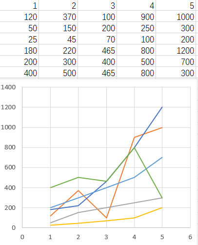
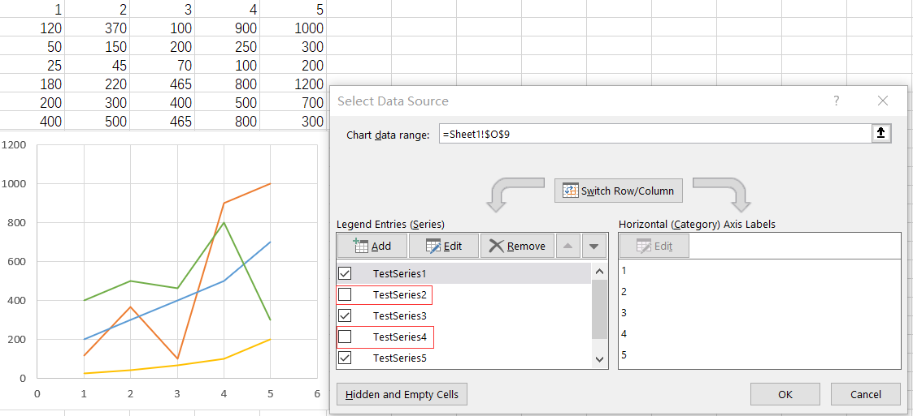

{}

## **Filtering out series to render a chart**

In Excel, we can filter out specific series from a chart, causing those filtered series not to be displayed in the chart. The original chart is shown in **Figure 1**. However, when we filter out **Testseries2** and **Testseries4**,the chart will appear as shown in **Figure 2**.

In Aspose.Cells, we can perform a similar operation. For a [sample](seriesFiltered.xlsx) file like this, if we want to filter out **Testseries2** and **Testseries4**,we can execute the following code. Additionally, we will maintain two lists: one ([NSeries](https://reference.aspose.com/cells/net/aspose.cells.charts/chart/nseries/)) list to store all the selected series and another ([FilteredNSeries](https://reference.aspose.com/cells/net/aspose.cells.charts/chart/filteredSeries/))  to store the filtered series.

Please **note** that in the code, when we set **chart.NSeries[0].IsFiltered = true;**, the first series in [NSeries](https://reference.aspose.com/cells/net/aspose.cells.charts/chart/nseries/) will be removed and placed in the appropriate position within  [FilteredNSeries](https://reference.aspose.com/cells/net/aspose.cells.charts/chart/filteredSeries/). Subsequently, the previous **NSeries[1]** will become the new first item in the list, and all the following series will shift forward by one position. This means that if we then run **chart.NSeries[1].IsFiltered = true;**, we are effectively removing the original third series. This can sometimes lead to confusion, so we recommend following the operation in the code, which deletes series from the end to the beginning.

## **Sample Code**
The following sample code loads the [sample Excel file](seriesFiltered.xlsx).



