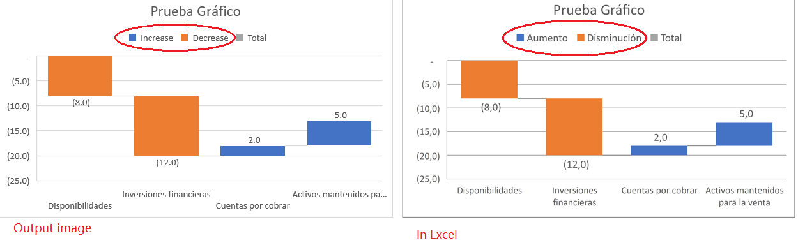

{}

In this topic, we will show you how to do globalization setting for a chart.

{}

## **Scenario**

In what scenario we would need to do globalization setting for a chart? 

When you open an xlsx file with a chart in Excel, you can see the elements in chart area, such as Chart Title, Lengend, etc. But when you save this chart as a picture, you may encounter the following issue: 

****

In this scenario, the Chart Lengend in output picture are not the same as in Excel. Now you can solve this issue by doing globalization setting for chart. With the correct settings, the following elements will be rendered according to your localization settings.

## **Supported elements**

The following elements in chart can be rendered according to your localization settings.

|**Supported elements**|**default value in the English environment**|
| :- | :- |
|Axis Title Name|Axis Title|
|Axis Unit Name|Hundreds, Thousands...|
|Chart Title Name|Chart Title|
|Legend Increase Name|Increase|
|Legend Decrease Name|Decrease|
|Legend Total Name|Total|
|Other Name|Other|
|Series Name|Series|

## **Operation Steps**

The following example will show you in details how to do Globalization Settings to achieve the effect you want.

- [How to do Japanese Setting for Chart](/cells/net/do-japanese-setting-for-chart/)

## **Success stories**

### Turkish Language Setting

### Japanese Language Setting

