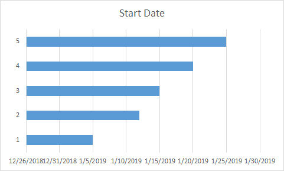

## What is Gantt chart

A Gantt chart helps you schedule your project tasks and then helps you track your progress.

## Add Gantt chart in Excel

Need to show status for a simple project schedule with a Gantt chart? Though Excel doesn’t have a predefined Gantt chart type, you can simulate one by customizing a stacked bar chart to show the start and finish dates of tasks, like this:

## How to create

- Select the data you want to chart. In our example, that’s B1:B7,and then Insert **Stacked Bar** chart.

- Selett the chart,**Select Data**->**Add**,set the **Series name** and **Series values** as following

- Select the chart,Edit the **Horizontal(Category) Axis Labels**

- **Format Axis** the Y Axis,select **Categories in reverse order**
- Seletct the **Blue Series** and set the **Fill->NO Fill**
- **Format Axis** the X Axis,set the **Mininum and Maxinum**(1/5/2019:43470,1/30/2019:43494)

- **Add Data lebles** for the chart
Now you get a gantt chart.

## Add Gantt chart in Aspose.Cells

The following sample code creates a Gantt chart by open a [sample file](sample.xlsx)



You will get a file similar to [result file](result.xlsx).In the file, you will see the following:

