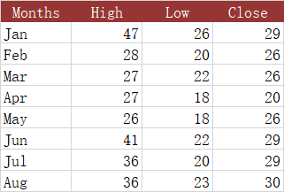

## **Possible Usage Scenarios**
The High-Low-Close (HLC) stock chart uses four columns of data. The first column is a category, usually a date but stock names can also be used. The next three columns in order are for high, low, and closing prices. The range of price for each category is indicated by a vertical line from low to high, and closing price is shown using a tickmark extending to the right of this line.

## **Visibility improvements in the chart**
Sometimes, to make the chart look more intuitive, we can modify the appearance of the marker (close), or make it display on the secondary axis.

## **Sample Code**
The following sample code loads the [sample Excel file](High-Low-Close.xlsx) and generates the [output Excel file](out.xlsx).


