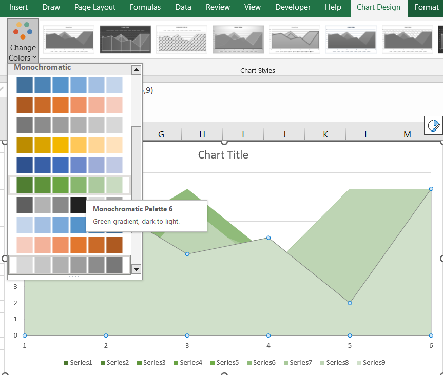

## **Possible Usage Scenarios**
In Excel, as shown in the figure below, you can change the color of the chart series by setting the theme color.

Using Aspose.Cells API, you can also set the theme color for the chart series.

## **Change Theme Colors**
The following sample code loads the [sample Excel file](Test.xlsx) and generates the [output Excel file](Output.xlsx).



In this sample code, "ChartColorPaletteType.MonochromaticPalette6" indicates the use of the sixth theme color in the drop-down box under the Excel interface.

