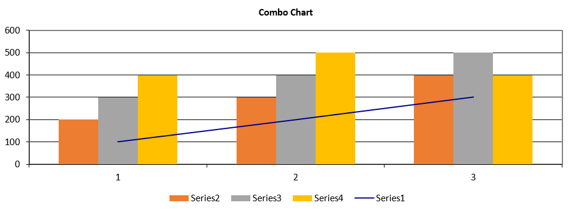

## **Possible Usage Scenarios**
Combo charts in Excel let you avail of this option because you can easily combine two or more chart types to make your data understandable. Combo charts are helpful when your data contains multiple kinds of values including price and volume. Moreover, Combo charts are feasible when your data numbers change widely from series to series.

Now we will create a column-line combo chart. We will first create a column chart, and then modify some Series Type to line to achieve this combo chart.

## **Combo chart**
After running the code below, you will see the Combo chart as shown below.

## **Sample Code**
The following sample code loads the [sample Excel file](combo.xlsx) and generates the [output Excel file](out.xlsx).


