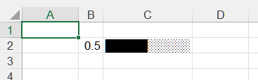
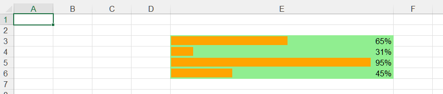
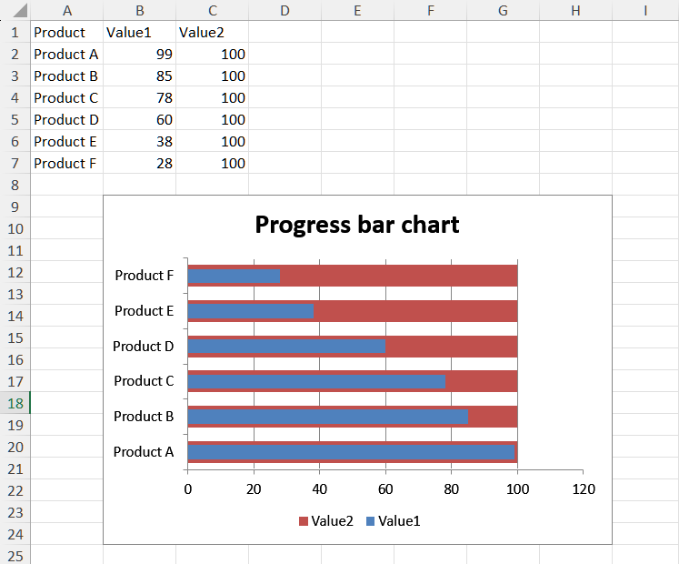

## **Possible Usage Scenarios**
The primary reason to create a progress bar in Excel is to transform raw numbers into an instantly understandable visual metric, making complex data simple to grasp at a glance.

1. **Enhanced Visual Clarity and Immediate Insight:** A table with numbers like "75 %", "8/10", or "15000/20000" requires cognitive effort to interpret. A progress bar allows anyone, from a senior manager to a team member, to understand the status, performance, or completion level instantly without reading and processing the numbers.

2. **Quick Identification of Status and Trends:** Our brains are wired to process visual information like length and color faster than text. You can quickly see: What’s on track? (Long, green bars), What’s behind? (Short, red bars), and What’s almost complete? (Almost full bars). This allows for faster decision‑making and prioritization.

3. **Improved Dashboards and Reports:** Progress bars are a cornerstone of effective dashboards. They make reports more engaging, professional, and easier to present. A dashboard with progress bars for key performance indicators (KPIs) is far more effective than a sheet full of numbers.

4. **Motivation and Performance Tracking:** For sales teams, project trackers, or personal goals, seeing a visual representation of progress can be highly motivating. It provides a clear and satisfying sense of accomplishment as the bar fills up.

5. **Efficient Communication:** In meetings or presentations, a progress bar conveys the message much more effectively than saying, “We are at 72.5 % of our quarterly goal.” The visual does the talking, saving time and preventing misinterpretation.

## **How to Create a Progress Bar in Excel**

Creating a progress bar in Excel is a great way to visualize task completion, project progress, or data trends. Here’s a guide on how to create one using different methods, along with some tips for customization.

### **Using Conditional Formatting (Data Bars)**
1. **Prepare Your Data:** Have at least one column of values representing progress, ideally as percentages (e.g., 0.5 for 50 %). You can calculate this using a formula like `=Current_Value/Target_Value`.  
2. **Select Cells:** Highlight the cells containing your percentage values.  
3. **Apply Data Bars:** Go to **Home** → **Conditional Formatting** → **Data Bars**. Choose either Gradient Fill or Solid Fill.  
4. **Customize (Optional):** For more control, go to **Conditional Formatting** → **Manage Rules** → **Edit Rule**.  
5. **Set the Minimum and Maximum types** to *Number*, with values **0** and **1**, respectively, to ensure accurate 0‑100 % display.  
6. **Adjust colors and border styles** here. To display both the number and the bar, edit the rule and ensure **“Show Bar Only”** is unchecked.

### **Using the REPT Function (Text‑based Bar)**
1. **Enter Formula:** In a cell, use a formula like  
   `=REPT("█", B2*10) & REPT("░", 10 - B2*10)` , where **B2** contains the progress percentage. This example creates a 10‑character bar: filled squares (█) for completion and light squares (░) for remaining.  
2. **Adjust and Format:** Adjust the multiplier (e.g., `*20` for a 20‑character bar) based on your desired length. Use a monospace font like **Courier New** for proper alignment.

### **Using a Chart (For Dashboards)**
1. **Structure Data:** Create a table to calculate values:  

   | **Number** | **A**       | **B**       |
   |------------|-------------|-------------|
   | 1          | Progress    | Remaining   |
   | 2          | =Current_Value/Target_Value | =1‑A2 |

2. **Insert Chart:** Select the data → **Insert** tab → **Charts** → **2‑D Stacked Bar Chart**.  
3. **Format Chart:** Remove chart title, legend, and gridlines for a clean look. **Right‑click** the “Remaining” data series → **Format Data Series** → **Fill** → **No Fill**. **Right‑click** the “Progress” series → **Format Data Series** → adjust **Series Overlap** to **100 %** and **Gap Width** to **0 %**. Format the horizontal axis: set **Bounds** → **Minimum** to **0** and **Maximum** to **1**.

## **How to Create a Progress Bar in Aspose.Cells**

### **Use REPT Function (Text‑based Bar) to Create a Progress Bar**
Please see the following sample code. It creates a new workbook and **adds** some sample data. It then adds a REPT Function (Text‑based Bar) based on the initial data. Finally, it saves the workbook to an **.xlsx** file. The following screenshot shows the text‑based bar created by Aspose.Cells in the output Excel file.  
 



### **Use Conditional Formatting (Data Bars) to Create a Progress Bar**
Please see the following sample code. It creates a new workbook and **adds** some sample data. It then adds conditional formatting (Data Bars) based on the initial data and sets relevant properties. Finally, it saves the workbook to an **.xlsx** file. The following screenshot shows the conditional formatting (Data Bars) created by Aspose.Cells in the output Excel file.  
 



### **Use a Stacked Bar Chart to Create a Progress Bar**
Please see the following sample code. It loads the [sample Excel file](sample.xlsx) that contains some sample data. It then creates a stacked bar chart based on the initial data and sets relevant properties. Finally, it saves the workbook to the output **.xlsx** format. The following screenshot shows the progress bar created by Aspose.Cells in the output Excel file.  
 


