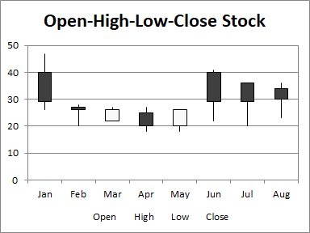

## **Possible Usage Scenarios**
The Open-High-Low-Close (OHLC) chart uses five columns of data, in order: category, open, high, low, and close. The range of prices in each category is again indicated by a vertical line, while the range between open and close is given by a wider floating bar; if the price increases in the category (close is higher than open), the bar is filled with one color, while if the price decreases, the bar is filled with another. This type of chart is often called a candlestick chart.

## **Visibility improvements in the chart**
We often use colors rather than black and white to indicate increasing and decreasing prices.  In the first set of candlesticks below, red shows increasing nad green decreasing prices.

## **Sample Code**
The following sample code loads the [sample Excel file](Open-High-Low-Close.xlsx) and generates the [output Excel file](out.xlsx).


