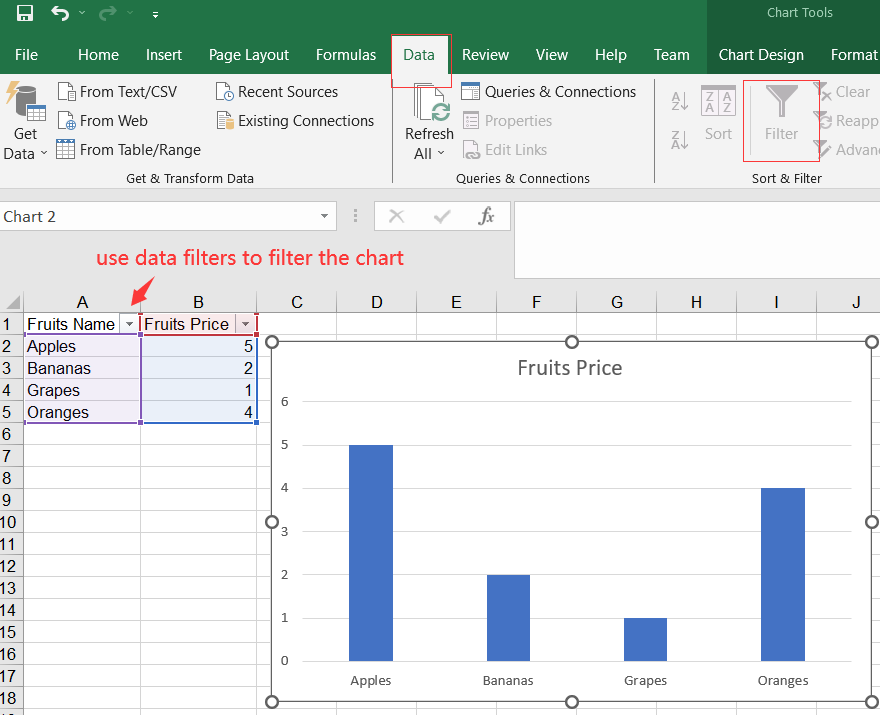
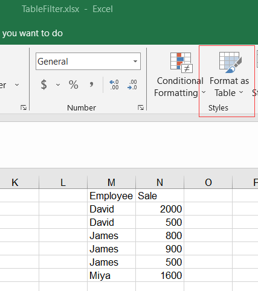

## **1. Filtering out series to render a chart**

### **Steps to filter series from a chart in Excel**
In Excel, we can filter out specific series from a chart, causing those filtered series not to be displayed in the chart. The original chart is shown in **Figure 1**. However, when we filter out **Testseries2** and **Testseries4**,the chart will appear as shown in **Figure 2**.

In Aspose.Cells, we can perform a similar operation. For a [sample](seriesFiltered.xlsx) file like this, if we want to filter out **Testseries2** and **Testseries4**,we can execute the following code. Additionally, we will maintain two lists: one ([NSeries](https://reference.aspose.com/cells/net/aspose.cells.charts/chart/nseries/)) list to store all the selected series and another ([FilteredNSeries](https://reference.aspose.com/cells/net/aspose.cells.charts/chart/filterednseries/))  to store the filtered series.

Please **note** that in the code, when we set **chart.NSeries[0].IsFiltered = true;**, the first series in [NSeries](https://reference.aspose.com/cells/net/aspose.cells.charts/chart/nseries/) will be removed and placed in the appropriate position within  [FilteredNSeries](https://reference.aspose.com/cells/net/aspose.cells.charts/chart/filterednseries/). Subsequently, the previous **NSeries[1]** will become the new first item in the list, and all the following series will shift forward by one position. This means that if we then run **chart.NSeries[1].IsFiltered = true;**, we are effectively removing the original third series. This can sometimes lead to confusion, so we recommend following the operation in the code, which deletes series from the end to the beginning.

### **Sample Code**
The following sample code loads the [sample Excel file](seriesFiltered.xlsx).



## **2. Filter the data and let the chart change**

Filtering your data is a great way to handle chart filters with a lot of data. When you filter the data, the chart will change.  One issue we're going to have to address is making sure the chart stays on the screen. When you filter, you get hidden rows, and occasionally, the chart will be in those hidden rows.

### **Steps to use Data Filters to change the chart in Excel**

1. Click inside your data range.
2. Click the **Data** tab, and turn on Filters by clicking Filters. Your header row will have drop down arrows.
3. Create a chart by going to **Insert** tab and selecting a columns chart.
4. Now filter your data using the drop down arrows in the data. Don't use the Chart Filters.

### **Sample Code**
The following sample code shows the same featrue using Aspsoe.Cells.



## **3. Filter the data using a Table and let the chart change**

Using a Table is similar to Method 2, using a range, but you have advantages with tables over ranges. When you change your range to a Table and add data, the chart automatically updates. With a range, you will have to change the data source.

### **Format as table in Excel**

Click inside your data and use **CTRL + T** or use the Home tab, **Format as Table**

### **Sample Code**
The following sample code loads the [sample Excel file](TableFilters.xlsx) shows the same featrue using Aspsoe.Cells.



