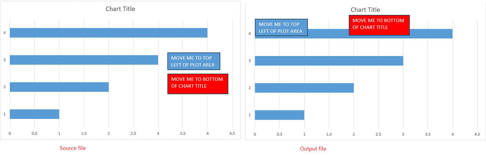

## Possible Usage Scenarios
In some scenarios, when you are using Excel chart, you may need to get the position of the objects in the chart. You can easily achieve this requirement with Aspose.Cells.

## Example: Get object position in chart

The following sample code loads the [sample Excel file](TestFile.xlsx) and generates the [output Excel file](Output.xlsx).


With the above code, you can get the position of the chart title and chart PlotArea. 
With the positional information, the shapes can be placed in the corresponding position in the chart. 
The output is shown in the following picture, where one shape is placed in the top left corner of the PlotArea and the other shape is placed below the chart title.

## Unit explanation and conversion

There are three units for the position of object in chart:

1. Units of ratio of the chart area.

2. Units of 1/4000 of the chart area. This is a unit used in older versions of Excel file, and it is not recommended.

3. Units of pixel.

The conversion code of them is shown in the following code: 




