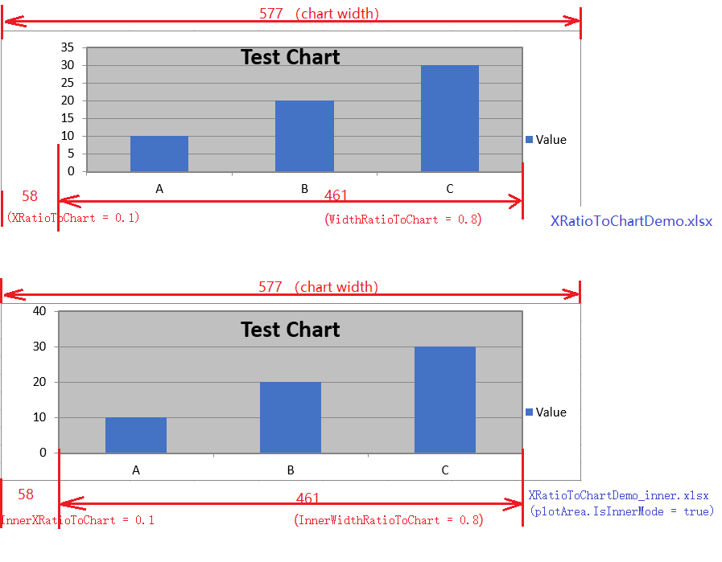

{}
**PlotArea** is the drawable region of a chart where series are rendered. Aspose.Cells allows you to control its size and position either automatically (default) or by specifying exact ratios relative to the whole chart. Understanding the **IsAutomaticSize**, **IsInnerMode** flags and the eight ratio properties helps you create precisely‐laid‐out charts.
{}

## **Introduction**
When a chart is generated, Aspose.Cells automatically computes a plot area that accommodates axis titles, legends, data labels, etc. In many scenarios you may want to override this behaviour—for example, to align multiple charts on a single worksheet, reserve a fixed empty margin, or embed a chart inside a pre‐designed template. The **PlotArea** class provides two switches and a set of ratio properties to achieve that.

| Property | Category | Default |
|----------|----------|----------|
| **IsAutomaticSize** | Layout mode switch | **true** |
| **IsInnerMode** | Ratio source switch | **false** |
| **XRatioToChart**, **YRatioToChart**, **WidthRatioToChart**, **HeightRatioToChart** | Outer ratios (used when *IsInnerMode = false*) |  |
| **InnerXRatioToChart**, **InnerYRatioToChart**, **InnerWidthRatioToChart**, **InnerHeightRatioToChart** | Inner ratios (used when *IsInnerMode = true*) |  |

The sections below explain each flag, their impact, and demonstrate how to use them in code.

---

## **IsAutomaticSize**
### **What it does**
- **true (default)** – Aspose.Cells calculates the plot area automatically based on the chart’s internal elements (legend, title, data labels, etc.).
- **false** – The plot area size and position are taken from the ratio properties you set. The library **does not** adjust the area for axis titles or legends, so you must ensure enough space manually.

### **Impact of changing the flag**
| Setting | Behaviour |
|---------|-----------|
| **IsAutomaticSize = true** | The chart adapts to content changes (e.g., longer axis titles) without extra code. |
| **IsAutomaticSize = false** | The chart keeps the exact dimensions you defined, even if the content overflows. Useful for consistent layout across multiple sheets. |

{}
When **IsAutomaticSize** is disabled, the legend and axis titles may be clipped if they extend beyond the plot area. Ensure you reserve enough margin using the ratio values.
{}

---

## **IsInnerMode**
### **What it does**
- **Only for Xlsx file.**
- **false (default)** – The chart uses the **outer** ratio properties: **XRatioToChart**, **YRatioToChart**, **WidthRatioToChart**, **HeightRatioToChart**.
- **true** – The chart uses the **inner** ratio properties: **InnerXRatioToChart**, **InnerYRatioToChart**, **InnerWidthRatioToChart**, **InnerHeightRatioToChart**.

### **Difference between outer and inner ratios**
- **Outer ratios** measure the plot area **from the outer border of the chart** (including the legend area). They are useful when you want to keep a fixed distance from the chart’s edge.
- **Inner ratios** measure the plot area **from the inner border**, i.e., after the legend (if placed inside) and after any chart‐level padding. This mode is handy when you need the plot area to occupy a specific percentage of the *available* drawing space inside the chart.

### **When to choose each mode**
| Mode | Typical use case |
|------|------------------|
| **IsInnerMode = false** | Align multiple charts to share the same outer margins, regardless of legend placement. |
| **IsInnerMode = true** | Keep the plot area proportional to the *actual* drawing canvas (e.g., when legends are inside the chart). |

**Code example:**
```csharp
            path = "";
            string filePath = path + "XRatioToChartDemo.xlsx";
            // Create workbook and populate data
            var workbook = new Workbook();
            var worksheet = workbook.Worksheets[0];
            worksheet.Cells["A1"].PutValue("Category");
            worksheet.Cells["A2"].PutValue("A");
            worksheet.Cells["A3"].PutValue("B");
            worksheet.Cells["A4"].PutValue("C");
            worksheet.Cells["B1"].PutValue("Value");
            worksheet.Cells["B2"].PutValue(10);
            worksheet.Cells["B3"].PutValue(20);
            worksheet.Cells["B4"].PutValue(30);
            // Add chart
            int chartIndex = worksheet.Charts.Add(ChartType.Column, 5, 1, 15, 10);
            var chart = worksheet.Charts[chartIndex];
            chart.SetChartDataRange("A1:B4", true);
            chart.Title.Text = "Test Chart";
            // Verify default XRatioToChart
            var chartArea = chart.ChartArea;
            var plotArea = chart.PlotArea;
            plotArea.XRatioToChart = 0.1;
            plotArea.YRatioToChart = 0.05;
            plotArea.WidthRatioToChart = 0.8;
            plotArea.HeightRatioToChart = 0.9;

            // Save workbook
            workbook.Save(filePath);
            // Reload and verify persisted value
            var loadedWorkbook = new Workbook(filePath);
            var loadedChart = loadedWorkbook.Worksheets[0].Charts[0];
            plotArea = loadedChart.PlotArea;
            plotArea.IsInnerMode = true;
            plotArea.InnerXRatioToChart = 0.1;
            plotArea.InnerYRatioToChart = 0.05;
            plotArea.InnerWidthRatioToChart = 0.8;
            plotArea.InnerHeightRatioToChart = 0.9;

            loadedWorkbook.Save(path + "XRatioToChartDemo_inner.xlsx");
```
Output comparison



---

## **Ratio Parameters Explained**
All eight ratio properties are **relative values** ranging from **0.0** to **1.0** (0 % – 100 %). They represent a percentage of the total chart size.

| Property | Meaning |
|----------|---------|
| **XRatioToChart** | Horizontal offset of the **left** edge of the plot area from the chart’s left border (outer mode). |
| **YRatioToChart** | Vertical offset of the **top** edge of the plot area from the chart’s top border (outer mode). |
| **WidthRatioToChart** | Width of the plot area as a fraction of the chart’s total width (outer mode). |
| **HeightRatioToChart** | Height of the plot area as a fraction of the chart’s total height (outer mode). |
| **InnerXRatioToChart** | Horizontal offset from the **inner** left border (inner mode). |
| **InnerYRatioToChart** | Vertical offset from the **inner** top border (inner mode). |
| **InnerWidthRatioToChart** | Width of the plot area relative to the **inner** width (inner mode). |
| **InnerHeightRatioToChart** | Height of the plot area relative to the **inner** height (inner mode). |

---

## **Practical Example – Controlling PlotArea with All Parameters**
The following fully runnable example demonstrates:
1. Creating a simple column chart.
2. Switching **IsAutomaticSize** to **false**.
3. Using **outer ratios** (default *IsInnerMode = false*).
4. Switching to **inner mode** and applying inner ratios.
5. Saving two workbooks for side‐by‐side comparison.

```csharp
// For complete examples and data files, please go to https://github.com/aspose-cells/Aspose.Cells-for-.NET
using System;
using Aspose.Cells;
using Aspose.Cells.Charts;

namespace PlotAreaDemo
{
    class Program
    {
        static void Main()
        {
            // -----------------------------------------------------------------
            // 1. Prepare sample data (A1:B5)
            // -----------------------------------------------------------------
            string dataDir = "./";
            Workbook wb = new Workbook();
            Worksheet ws = wb.Worksheets[0];
            Cells cells = ws.Cells;

            // Header
            cells["A1"].PutValue("Month");
            cells["B1"].PutValue("Sales");

            // Sample data
            string[] months = { "Jan", "Feb", "Mar", "Apr", "May" };
            double[] sales = { 1200, 1500, 1800, 1300, 1700 };
            for (int i = 0; i < months.Length; i++)
            {
                cells[i + 1, 0].PutValue(months[i]);   // Column A
                cells[i + 1, 1].PutValue(sales[i]);   // Column B
            }

            // -----------------------------------------------------------------
            // 2. Add a column chart.
            // -----------------------------------------------------------------
            int chartIndex = ws.Charts.Add(ChartType.Column, 5, 1, 15, 10);
            Chart chart = ws.Charts[chartIndex];
            chart.Title.Text = "Monthly Sales";
            chart.SetChartDataRange("A2:B6", true);

            // -----------------------------------------------------------------
            // 3. Disable automatic sizing – we will set ratios ourselves.
            // -----------------------------------------------------------------
            chart.PlotArea.IsAutomaticSize = false;

            // -----------------------------------------------------------------
            // 4. Use outer ratios (IsInnerMode = false – default)
            // -----------------------------------------------------------------
            chart.PlotArea.XRatioToChart = 0.12;          // 12 % from left border
            chart.PlotArea.YRatioToChart = 0.15;          // 15 % from top border
            chart.PlotArea.WidthRatioToChart = 0.75;      // 75 % of chart width
            chart.PlotArea.HeightRatioToChart = 0.65;     // 65 % of chart height

            // Save the first workbook – outer mode
            wb.Save(dataDir + "Chart_OuterPlotArea.xlsx");

            // -----------------------------------------------------------------
            // 5. Create a second workbook to demonstrate inner mode.
            // -----------------------------------------------------------------
            Workbook wbInner = new Workbook(dataDir + "Chart_OuterPlotArea.xlsx");
            Chart chartInner = wbInner.Worksheets[0].Charts[chartIndex];

            // Switch to inner mode and supply inner ratios
            chartInner.PlotArea.IsInnerMode = true;
            chartInner.PlotArea.InnerXRatioToChart = 0.05;      // 5 % from inner left border
            chartInner.PlotArea.InnerYRatioToChart = 0.05;      // 5 % from inner top border
            chartInner.PlotArea.InnerWidthRatioToChart = 0.9;   // 90 % of inner width
            chartInner.PlotArea.InnerHeightRatioToChart = 0.9;  // 90 % of inner height

            // The outer ratios are ignored when IsInnerMode = true.
            // Save the second workbook – inner mode
            wbInner.Save(dataDir + "Chart_InnerPlotArea.xlsx");

            Console.WriteLine("Charts created successfully.");
        }
    }
}
```

### **Explanation of the code**
| Step | What the code does |
|------|--------------------|
| **Data preparation** | Inserts a small data table that the chart will consume. |
| **Add chart** | Creates a column chart and links it to the data range. |
| **IsAutomaticSize = false** | Turns off the automatic calculation so that the plot area respects the ratios we set. |
| **Outer ratios (default mode)** | `XRatioToChart = 0.12` ⇒ 12 % margin on the left side of the whole chart.<br>`WidthRatioToChart = 0.75` ⇒ Plot area fills 75 % of the chart’s width, etc. |
| **Save first file** | `Chart_OuterPlotArea.xlsx` shows a chart with an outer‐ratio‐driven plot area. |
| **Clone workbook** | Re‐uses the same data & chart to illustrate inner mode without rebuilding the sheet. |
| **IsInnerMode = true + inner ratios** | Offsets and sizes are now measured from the *inner* border (i.e., after the legend if it resides inside the chart). |
| **Save second file** | `Chart_InnerPlotArea.xlsx` demonstrates the inner‐mode layout. |

Open the two generated workbooks side‐by‐side to see how the plot area changes:

* **Outer mode** – the plot area respects the *outer* margins (including the space occupied by the legend that sits **outside** the plot area).
* **Inner mode** – the plot area is calculated after the legend is placed **inside** the chart, giving a slightly different visual balance.

---

## **Best‐Practice Recommendations**
1. **Start with automatic size** – most cases are covered by the default layout.
2. **Disable automatic size only when you need a fixed layout** (e.g., report templates, dashboards).
3. **Prefer inner mode** if your legend or data labels are set to appear **inside** the chart area; otherwise, stick with outer mode.
4. **Validate ratios** – ensure `Offset + Size ≤ 1.0` for both horizontal and vertical dimensions; otherwise the plot area may be truncated.
5. **Test with different data volumes** – when `IsAutomaticSize = false`, long axis titles or many data points may overflow the plot area.
6. **Combine with chart customizations** (e.g., `chart.Legend.Position = LegendPositionType.Bottom`) to achieve the exact layout you need.

---

## **Related Articles**
- [Working with Charts in Aspose.Cells](/net/working-with-charts/)
- [Customizing Chart Legend](/net/customizing-chart-legend/)
- [Creating Dynamic Dashboards](/net/creating-dynamic-dashboards/)


