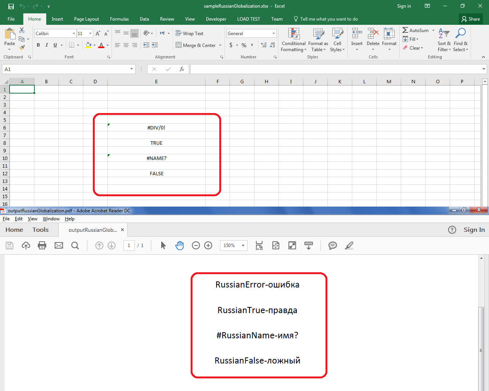

## **Possible Usage Scenarios**

If you are using Microsoft Excel in a Russian locale or language, or any other locale or language, it will display errors and Boolean values according to that locale or language. You can achieve similar behavior using Aspose.Cells by using the [**Workbook.Settings.GlobalizationSettings**](https://reference.aspose.com/cells/net/aspose.cells/workbooksettings/properties/globalizationsettings) property. You will have to override the following methods of [**GlobalizationSettings**](https://reference.aspose.com/cells/net/aspose.cells/globalizationsettings) class.

- [**GlobalizationSettings.GetErrorValueString()**](https://reference.aspose.com/cells/net/aspose.cells/globalizationsettings/methods/geterrorvaluestring)
- [**GlobalizationSettings.GetBooleanValueString()**](https://reference.aspose.com/cells/net/aspose.cells/globalizationsettings/methods/getbooleanvaluestring)

## **Implement Errors and Boolean Value in Russian or Any Other Language**

The following sample code illustrates how to implement errors and Boolean values in Russian or any other language. Please refer to the [Sample Excel File](73990159.xlsx) used by this code and its [Output PDF](73990160.pdf). The screenshot shows the difference between the sample Excel file and the output PDF for reference.

## **Sample Code**



