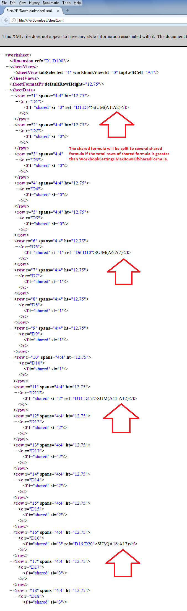

## **Possible Usage Scenarios**

The default maximum rows of the shared formula is 64. It could be any number, e.g., 1000. The performance of a shared formula changes with the number of rows. Therefore, Aspose.Cells provides the [**Workbook.Settings.MaxRowsOfSharedFormula**](https://reference.aspose.com/cells/net/aspose.cells/workbooksettings/properties/maxrowsofsharedformula) property that can be used to specify the maximum rows of the shared formula. The shared formula will be split into several shared formulas if the total rows of the shared formula are greater than this, as shown in the following screenshot.

## **Specify Maximum Rows of Shared Formula**

The following sample code explains the usage of the [**Workbook.Settings.MaxRowsOfSharedFormula**](https://reference.aspose.com/cells/net/aspose.cells/workbooksettings/properties/maxrowsofsharedformula) property. It sets the maximum rows of the shared formula to 5, adds the shared formula starting at cell D1 for 100 rows, and saves it to the [output Excel file](61767856.xlsx). If you extract the contents of the output Excel file and check the *sheet1.xml*, you will see that the shared formula splits after every 5 rows, as highlighted in the above screenshot.

## **Sample Code**



