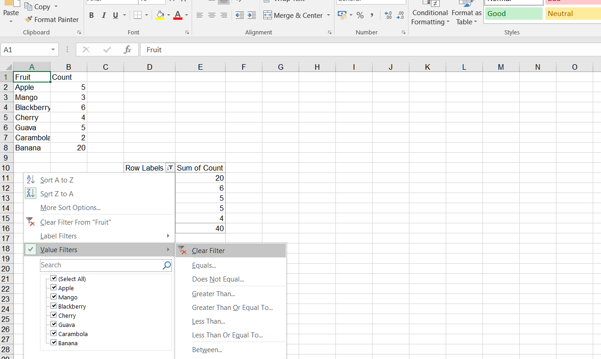

## **Possible Usage Scenarios**
When you create a pivot table with known data and want to filter the pivot table, you need to learn to use filters. It can help you filter out the data you want effectively. By using the Aspose.Cells API, you can add and clear filters on field values in Pivot Tables. 

## **Add Filter in Pivot Table in Excel**
To add a filter in a Pivot Table in Excel, follow these steps:

1. Select the PivotTable to which you want to add a filter. 
2. Click on the drop‑down arrow for the filter you want to add in the pivot table.
3. Select the "Top 10" from the drop‑down menu.
 

4. Set the show mode and the number of filters.
 

## **Add Filter in Pivot Table**
Please see the following sample code. It sets the data and creates a PivotTable based on it. Then adds a filter on the row field of the pivot table. Finally, it saves the workbook in [output XLSX](filterout.xlsx) format. After executing the example code, a pivot table with a Top 10 filter is added to the worksheet.

### **Sample Code**


## **Clear Filter in Pivot Table in Excel**
To clear a filter in a Pivot Table in Excel, follow these steps:

1. Select the PivotTable from which you want to clear the filter. 
2. Click on the drop‑down arrow for the filter you want to clear in the pivot table.
3. Select the "Clear Filter" from the drop‑down menu.
 

4. If you want to clear all filters from the pivot table, you can also click on the "Clear Filters" button in the PivotTable Analyze tab on the ribbon in Excel.
 

## **Clear Filter in Pivot Table**
Clear a filter in a Pivot Table using Aspose.Cells. Please see the following sample code. 
1. Set the data and create a PivotTable based on it. 
2. Add a filter on the row field of the pivot table. 
3. Save the workbook in [output XLSX](out_add.xlsx) format. After executing the example code, a pivot table with a Top 10 filter is added to the worksheet. 
4. Clear the filter on a specific pivot field. After executing the code to clear the filter, the filter on the specific pivot field will be cleared. Please check the [output XLSX](out_delete.xlsx).

### **Sample Code**


