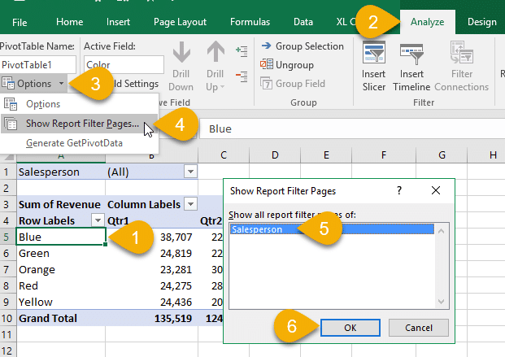

## **Show report filter pages option**
Excel supports creating pivot tables, adding report filters, and enabling the **"Show Report Filter Pages"** option. Aspose.Cells also supports this feature, enabling the **"Show Report Filter Pages"** option on the created pivot table. The following screenshot shows the **"Show Report Filter Pages"** option in Excel.

Sample source file and output files can be downloaded from here for testing the sample code:

[Source Excel File](81920786.xlsx)

[Output Excel File](81920787.xlsx)



