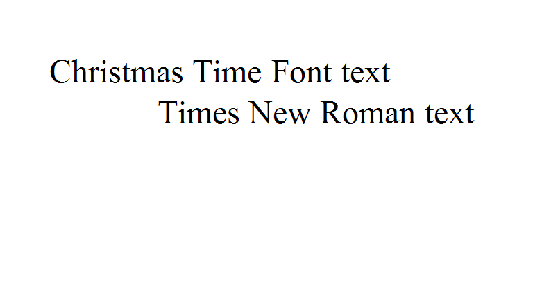

---  
title: Set DefaultFont property of PdfSaveOptions and ImageOrPrintOptions to have priority  
type: docs  
weight: 30  
url: /net/set-defaultfont-property-of-pdfsaveoptions-and-imageorprintoptions-to-have-priority/  
ai_search_scope: cells_net
ai_search_endpoint: "https://docsearch.api.aspose.cloud/ask"
---  

## **Possible Usage Scenarios**  

While setting the **DefaultFont** property of [**PdfSaveOptions**](https://reference.aspose.com/cells/net/aspose.cells/pdfsaveoptions) and [**ImageOrPrintOptions**](https://reference.aspose.com/cells/net/aspose.cells.rendering/imageorprintoptions), you might expect that saving to PDF or image would set that DefaultFont for all the text in a workbook that has a missing (not installed) font.  

Generally, when saving to PDF or image, Aspose.Cells will first try to set the workbook's default font (i.e., `Workbook.DefaultStyle.Font`). If the workbook's default font still cannot show/render text properly, then Aspose.Cells will try to render with the font specified by the `DefaultFont` attribute in [**PdfSaveOptions**](https://reference.aspose.com/cells/net/aspose.cells/pdfsaveoptions) / [**ImageOrPrintOptions**](https://reference.aspose.com/cells/net/aspose.cells.rendering/imageorprintoptions).  

To meet your expectation, we have a Boolean property named **`CheckWorkbookDefaultFont`** in [**PdfSaveOptions**](https://reference.aspose.com/cells/net/aspose.cells/pdfsaveoptions) / [**ImageOrPrintOptions**](https://reference.aspose.com/cells/net/aspose.cells.rendering/imageorprintoptions). You can set it to **false** to disable using the workbook's default font, allowing the `DefaultFont` setting in `PdfSaveOptions` / `ImageOrPrintOptions` to have priority.  

## **Set DefaultFont property of PdfSaveOptions/ImageOrPrintOptions**  

The following sample code opens an Excel file. The A1 cell (in the first worksheet) contains the text **"Christmas Time Font text"**. The font name is **"Christmas Time Personal Use"**, which is not installed on the machine. We set the ***DefaultFont*** attribute of [**PdfSaveOptions**](https://reference.aspose.com/cells/net/aspose.cells/pdfsaveoptions) / [**ImageOrPrintOptions**](https://reference.aspose.com/cells/net/aspose.cells.rendering/imageorprintoptions) to **"Times New Roman"**. We also set the **`CheckWorkbookDefaultFont`** Boolean property to **false**, which ensures that the text of the A1 cell is rendered with **"Times New Roman"** and does not use the workbook's default font (**"Calibri"** in this case). The code renders the first worksheet to PNG and TIFF image formats and finally to a PDF file format.  

{}  

The default value of ***CheckWorkbookDefaultFont*** attribute is **true**.  

{}  

This is a screenshot of the [template file](49446913.xlsx) used in the example code.  

  

This is the output PNG image after setting the [**ImageOrPrintOptions.DefaultFont**](https://reference.aspose.com/cells/net/aspose.cells.rendering/imageorprintoptions/defaultfont/) property to **"Times New Roman"**.  

  

See the output TIFF image after setting the [**ImageOrPrintOptions.DefaultFont**](https://reference.aspose.com/cells/net/aspose.cells.rendering/imageorprintoptions/defaultfont/) property to **"Times New Roman"**.  

See the output PDF file after setting the [**PdfSaveOptions.DefaultFont**](https://reference.aspose.com/cells/net/aspose.cells/pdfsaveoptions/properties/defaultfont) property to **"Times New Roman"**.  

## **Sample Code**  

  

