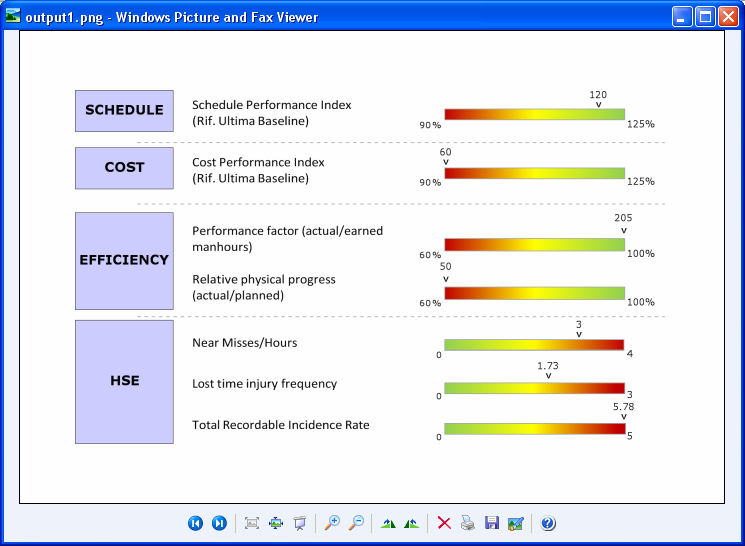

{}

Sometimes, you need to generate an image of your worksheet as a transparent image. You want to apply transparency to all cells **that** have no fill colors. Aspose.Cells provides the [**ImageOrPrintOptions.Transparent**](https://reference.aspose.com/cells/net/aspose.cells.rendering/imageorprintoptions/properties/transparent) property to apply transparency to the worksheet image. When this property is **false**, cells with no fill colors are drawn with **a** white color, and when it is **true**, cells with no fill colors are drawn **as** transparent.

{} 

In the following worksheet image, transparency has not been applied. The cells with no fill colors are drawn **in** white.

|**Output without transparency: the cell background is white**|
| :- |
||

**In contrast**, the following worksheet image shows transparency applied. The cells with no fill colors are transparent.

|**Output with transparency enabled**|
| :- |
||

The following sample code generates a transparent image from an Excel worksheet.



