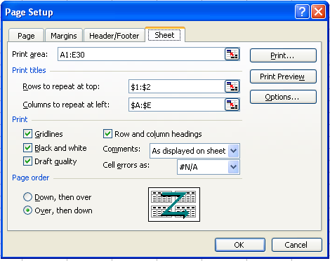

---  
title: Page Setup and Printing Options  
type: docs  
weight: 60  
url: /net/page-setup-and-printing-options/  
ai_search_scope: cells_net
ai_search_endpoint: "https://docsearch.api.aspose.cloud/ask"
---  

{}  

Sometimes, developers need to configure page setup and print settings to control the printing process. Page setup and print settings offer various options and are fully supported in Aspose.Cells.  

This article shows how to create a console application in Visual Studio .NET and apply page setup and printing options to a worksheet with a few simple lines of code using the Aspose.Cells API.  

{}  

## **Working with Page and Print Settings**  

For this example, we created a workbook in Microsoft Excel and used Aspose.Cells to set page setup and print options.  

### **Using Aspose.Cells to set Page Setup Options**  

First create a simple worksheet in Microsoft Excel. Then apply page setup options to it. Executing the code changes the Page Setup options as shown in the screenshot below.  

| **Output file.** |  
| :- |  
|  |  

1. Create a worksheet with some data in Microsoft Excel:  
   1. Open a new workbook in Microsoft Excel.  
   1. Add some data.  
2. Set page setup options:  
   Apply page setup options to the file. Below is a screenshot of the default options, before the new options are applied.  

| **Default page setup options.** |  
| :- |  
|  |  

3. Download and install Aspose.Cells:  
   1. [Download](https://downloads.aspose.com/cells/net) Aspose.Cells for .NET.  
   1. Install it on your development computer.  
      All Aspose components, when installed, work in evaluation mode. The evaluation mode has no time limit and it only injects watermarks into produced documents.  
4. Create a project:  
   1. Start Visual Studio .NET.  
   1. Create a new console application.  
      This example will show a C# console application, but you can use VB.NET too.  
5. Add references:  
   1. This example uses Aspose.Cells, so add a reference to that component to the project. For example:  
      …\Program Files\Aspose\Aspose.Cells\Bin\Net1.0\Aspose.Cells.dll  
6. Write the application that invokes the API:  

  

### **Setting Print Options**  

Page setup settings also provide several print options (also called sheet options) that allow users to control how worksheet pages are printed. They allow users to:  

- Select a specific print area of a worksheet.  
- Print titles.  
- Print gridlines.  
- Print row/column headings.  
- Achieve draft quality.  
- Print comments.  
- Print cell errors.  
- Define page ordering.  

The example that follows applies print options to the file created in the example above (PageSetup.xls). The screenshot below shows the default print options before new options are applied.  

| **Input document** |  
| :- |  
|  |  

Executing the code changes the print options.  

| **Output file** |  
| :- |  
|  |  

  

