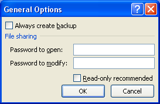

{}

Sometimes, you need to check if the given password matches the **Password to modify** programmatically. Aspose.Cells provides the `WorkbookSettings.WriteProtection.ValidatePassword()` method, which you can use to check whether the given password to modify is correct or not.

{}

## **Check Password to Modify in Microsoft Excel**

You can assign **Password to open** and **Password to modify** while creating your workbooks in Microsoft Excel. Please see this screenshot, which shows the interface that Microsoft Excel provides to specify these passwords.

||
| :- |

## **Check Password to Modify using Aspose.Cells**

The following sample code loads the [source Excel](5112232.xlsx) file. It has a password to open of **1234** and a password to modify of **5678**. The code first checks if **567** is the correct password to modify, which returns **false**, and then checks if **5678** is the password to modify, which returns **true**.



### **Console Output**

Here is the console output of the above sample code after loading the [source Excel](5112232.xlsx) file.


Is 567 correct Password to modify: False

Is 5678 correct Password to modify: True


