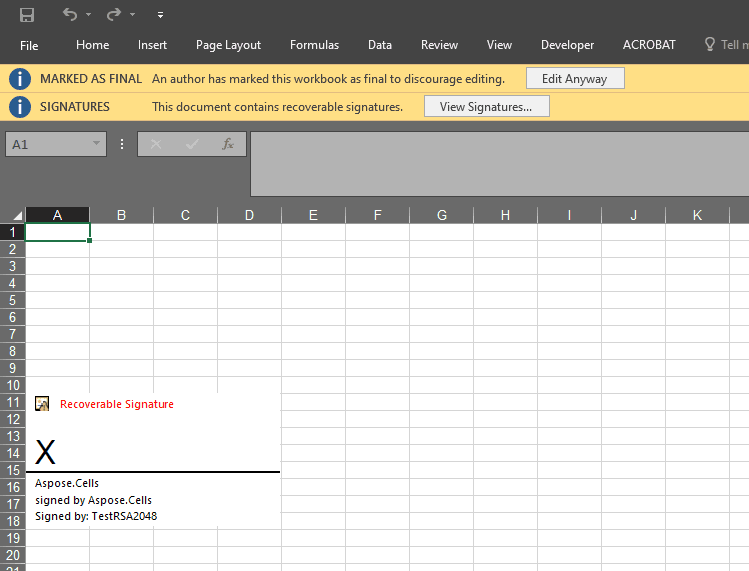

## **Introduction**

Aspose.Cells provides the [**Picture.SignatureLine**](https://reference.aspose.com/cells/net/aspose.cells.drawing/picture/properties/signatureline) property to add the signature line of the worksheet.

## **How to Add Signature Line to Worksheet**

The following sample code demonstrated how to make use of [**Picture.SignatureLine**](https://reference.aspose.com/cells/net/aspose.cells.drawing/picture/properties/signatureline) property to add the signature line of the worksheet. The screenshot shows the effect of the sample code on the sample Excel file after execution.

## **Sample Code**


