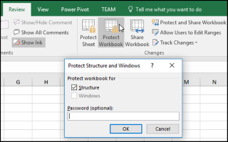

{}
To prevent other users from viewing hidden worksheets, adding, moving, deleting, or hiding worksheets, and renaming worksheets, you can protect the structure of your Excel workbook with a password.
{}

## **Protect and Unprotect Workbook Structure in MS Excel**

****

1. Click **Review > Protect Workbook**.  
2. Enter a password in **the Password box**.  
3. Select **OK**, re‑enter the password to confirm it, and then select **OK** again.

## **Protect Workbook Structure Using Aspose.Cells for .NET**
Only the following simple lines of code are needed to protect the workbook structure of Excel files.



## **Unprotect Workbook Structure Using Aspose.Cells for .NET**
Unprotecting workbook structure is easy with the Aspose.Cells API.



{}
Note: a correct password is required.
{}

