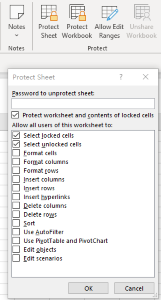

{}
To prevent other users from accidentally or deliberately changing, moving, or deleting data in a worksheet, you can lock the cells on your Excel worksheet and then protect the sheet with a password. 
{}

## **Protect and unprotect Worksheet in MS Excel**

****

1. Click **Review > Protect Worksheet**.
1. Enter a password in **the Password box**.
1. Select **allow** options.
1. Select **OK**, re-enter the password to confirm it, and then select **OK** again.

## **Protect Worksheet Using Aspose.Cell for .Net**
Only need the following simple lines of code to implement protecting workbook structure of Excel files.



## **Unprotect Worksheet Using Aspose.Cell for .Net**
Unprotecting worksheet is easy with Aspose.Cells API. If worksheet is password-protected, a correct password is required.



## **Advance topics**
- [Advanced Protection Settings since Excel XP](/cells/net/advanced-protection-settings-since-excel-xp/)
- [Detect if Worksheet is Password Protected](/cells/net/detect-if-worksheet-is-password-protected/)
- [Protecting Worksheets](/cells/net/protecting-worksheets/)
- [Unprotect a Worksheet](/cells/net/unprotect-a-worksheet/)
- [Verify Password Used to Protect the Worksheet](/cells/net/verify-password-used-to-protect-the-worksheet/)

