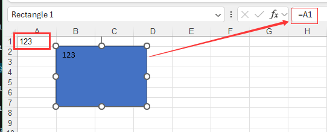

{}

Sometimes you need to display the contents of a worksheet cell in a shape, text box, or chart element. Sometimes, when the data in a cell or range of cells is modified, you need to synchronize the cell contents with the contents of a shape, text box, or chart element. To do this, you can link a shape, text box, or chart element to the cells that contain the data you want to display.

{}

## How to link shapes to cells in Ms Excel

The following figure shows how to set a linked cell for a shape.

1. Select a shape. The formula bar is usually empty.

2. Enter the shape's formula, such as "=A1"

## How to link shapes to cells in Aspose.Cells

The following code demonstrates how to use the Aspose.Cells library to set a link for a shape or text box to dynamically display cell contents.



## Advanced Usage

If you want the shape's text to consist of two or more cells, or if you want to select the desired content based on a formula, the above sample code may not meet your needs. In this case, you need to do something more advanced. You need to first place the formula that produces the desired result in a cell, and then link the shape to the cell containing the formula.



