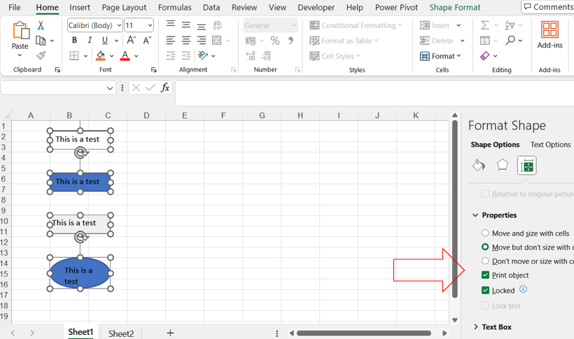
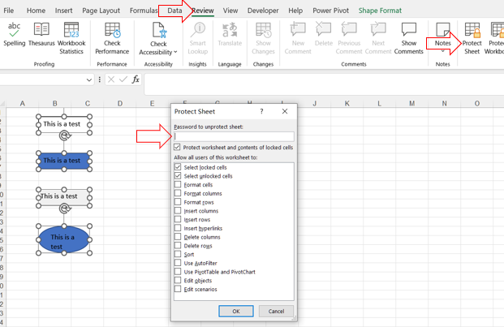

## **Possible Usage Scenarios**

Sometimes, you need to protect all shapes in certain worksheets to prevent them from being destroyed by unwanted situations. In this case, you need to lock all shapes in the specified worksheet. 

Locking shapes in a spreadsheet or document can be beneficial for several reasons:
1. Prevent Accidental Changes: Locking shapes ensures that they are not accidentally moved, resized, or deleted by users. This is particularly important in complex documents where shapes may be used for annotations, illustrations, or as part of the document's design.
1. Maintain Layout and Design: Shapes often play a crucial role in the layout and visual design of a document. Locking them preserves the intended appearance, ensuring that the document remains professional and visually appealing.
1. Data Integrity: In spreadsheets, shapes can be used to highlight important data points, add comments, or provide visual explanations. Locking these shapes ensures that the contextual information they provide remains accurate and intact.
1. Consistency in Shared Documents: When collaborating on documents, different users might have varying levels of expertise. Locking shapes helps maintain consistency across the document by preventing unintended alterations.
1. Security: In sensitive documents, locking shapes can be part of a broader strategy to protect information. For example, in financial reports or legal documents, locked shapes can be used to safeguard specific annotations or highlights that provide critical context.

Sometimes, you need to be able to modify certain shapes in certain protected worksheets, in which case, you need to unlock these shapes.This article will introduce in detail how to lock and unlock specified shapes.

## **How to Lock Shapes to Protect Them in Excel**

Here's how you can lock cells in Microsoft Excel:

1. Open Your Excel File: Open the Excel file that contains the shapes you want to lock.

1. Select the Shape: Click on the shape you want to lock. You can also select multiple shapes by holding down the Ctrl key and clicking on each shape.

1. Open the Format Shape Pane: Right-click on the selected shape(s) and choose "Size and Properties." Alternatively, you can go to the "Format" tab on the Ribbon, and in the "Size" group, click on the dialog launcher (a small arrow) to open the "Format Shape" pane.
1. Lock the Shape: In the "Format Shape" pane, go to the "Size & Properties" tab (the icon looks like a square with arrows). Under the "Properties" section, check the box for "Locked."
 

1. Protect the Worksheet: Go to the "Review" tab on the Ribbon. Click "Protect Sheet." Set a password (optional) and choose the permissions you want to allow (e.g., selecting locked cells, formatting cells, etc.). Click "OK."
 

## **How to Lock all shapes in a specified worksheet**

To protect all shapes in a specified worksheet, use the [Worksheet.Protect( ProtectionType.Objects)](https://reference.aspose.com/cells/net/aspose.cells/worksheet/protect/#protect) method, as shown in the following sample code.



## **How to Unlock specified shapes in a protected worksheet**

To unlock a specified shape in a protected worksheet, use [shape.IsLocked](https://reference.aspose.com/cells/net/aspose.cells.drawing/shape/islocked/), as shown in the following sample code.

Note: [shape.IsLocked](https://reference.aspose.com/cells/net/aspose.cells.drawing/shape/islocked/) is meaningful only when the worksheet is protected.



