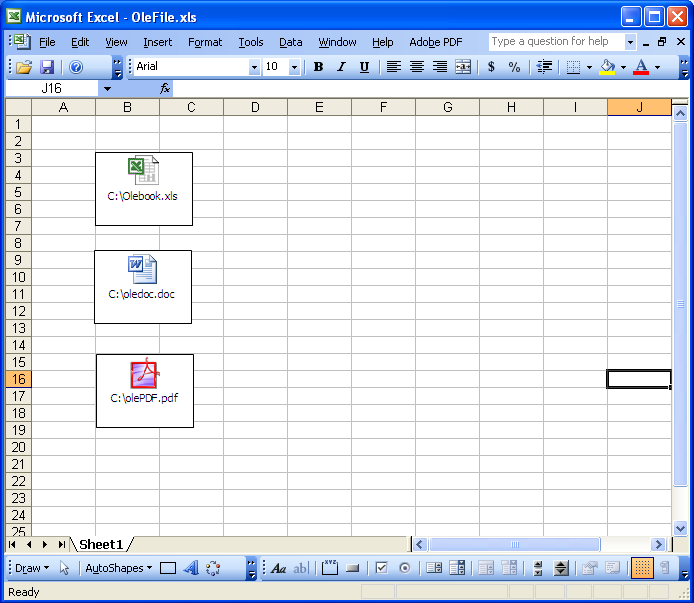

{}

Sometimes, you do need to extract OLE objects from a workbook. Aspose.Cells supports extracting and saving those Ole objects.

This article shows how to create a console application in Visual Studio.Net and extract different OLE objects from a workbook with a few simple lines of code.

{}

## **Extract OLE Objects from a Workbook**

### **Creating a Template Workbook**

1. Created a workbook in Microsoft Excel.
1. Add a Microsoft Word document, an Excel workbook and a PDF document as OLE objects on first worksheet.

|**Template document with OLE objects (OleFile.xls)**|
| :- |
||

Next extract the OLE objects and save them to the hard disk with their respective file types.

### **Download and Install Aspose.Cells**

1. [Download Aspose.Cells for .NET](https://downloads.aspose.com/cells/net).
1. Install it on your development computer.

All Aspose components, when installed, work in evaluation mode. The evaluation mode has no time limit and it only injects watermarks into produced documents.

### **Create a Project**

Start **Visual Studio.Net** and create a new console application. This example will show a C# console application, but you can use VB.NET too.

1. Add References
   1. Add a reference to Aspose.Cells component to your project, for example add a reference to ...\Program Files\Aspose\Aspose.Cells\Bin\Net1.0\Aspose.Cells.dll

### **Extract OLE Objects**

The code below does the actual work of finding and extracting OLE objects. The OLE objects (DOC, XLS and PDF files) are saved to disk.


