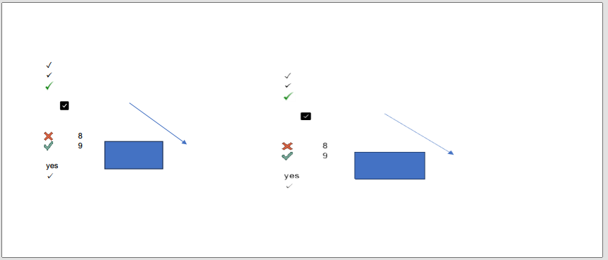
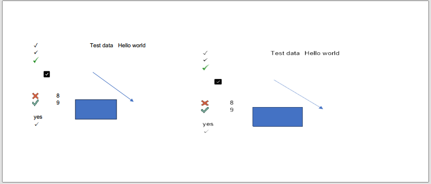

## **Possible Usage Scenarios**
The Camera tool in Excel is a hidden but powerful feature that lets you create a live, linked snapshot of any range of cells. Here's why and when you might use it.

What the Camera Tool Does:
1. Takes a "picture" of a selected range of cells.
2. The "picture" is a live link — if the source cells change, the image updates automatically.
3. You can move or resize the image anywhere on the sheet or even to another sheet.

## **How to Use Camera Function in Excel**
Here's a step-by-step guide to using the Camera Tool in Excel — a powerful way to create live, dynamic images of cell ranges.

### Enable the Camera Tool

The Camera tool is hidden by default. Here's how to add it:

1. Click the down arrow on the Quick Access Toolbar (top-left corner of Excel).
2. Choose More Commands....
3. In the dialog: From the “Choose commands from” dropdown, select Commands Not in the Ribbon. Scroll down and select Camera. Click Add >> to add it to the toolbar.
4. Click OK. You’ll now see a small camera icon in your toolbar.

### Use the Camera Tool
1. Select the cell range you want to capture (e.g., A1:C5).
2. Click the Camera icon on the Quick Access Toolbar.
3. Your cursor will change to a crosshair.
4. Click anywhere in the worksheet where you want to place the image. A live picture of the selected range is inserted.

### Dynamic Linking
The image is linked to the original cells. If the values or formatting in the source range change, the image updates automatically.

## **How to Add Camera for Range in Aspose.Cells for .NET**
Aspose.Cells supports displaying the contents of a cell or range in an image shape. You can link the picture to the cell or range that contains the data that you want to display. Since the cell or range is linked to the graphic object, changes that you make to the data in that cell or range automatically appear in the graphic object. 

Here's a basic example of how to Use Camera Function using [sample file](camera.xlsx) in Aspose.Cells for .NET:

1. Load the sample file using the [Workbook](https://apireference.aspose.com/cells/net/aspose.cells/workbook) class.
1. Add a picture to the worksheet by calling the [**AddPicture**](https://reference.aspose.com/cells/net/aspose.cells.drawing/shapecollection/methods/addpicture/index) method of the [**ShapeCollection**](https://reference.aspose.com/cells/net/aspose.cells.drawing/shapecollection) collection (encapsulated in the [**Worksheet**](https://reference.aspose.com/cells/net/aspose.cells/worksheet) object). 
1. Specify the cell range by using the [**Formula**](https://reference.aspose.com/cells/net/aspose.cells.drawing/picture/properties/formula) attribute of the [**Picture**](https://reference.aspose.com/cells/net/aspose.cells.drawing/picture) object.
1. Update the shapes selected value in the worksheet.



## **Output Result**
The following screenshot shows the camera of range(A1:E12) created by Aspose.Cells for .NET in the output Excel file.
 
Before adding data:
 

 
After adding data:
 

