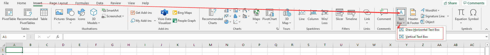
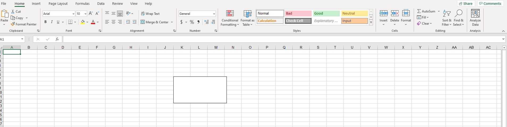

## Add Text Box to Worksheet in Excel

In the Excel program (version 07 and above), there are two places where you can insert text boxes. One is in **Insert Shapes**, and the other is on the right side of the top menu under the **Insert** option.

### Method One:

### Method Two:

## How to create

You can create text boxes with horizontal or vertical text.

- Select the corresponding option (horizontal or vertical)
- Left‑click on the page
- Hold down the left button and drag to the desired size on the page
- Release the left button

Now you have a text box.

## Add Text Box to Worksheet in Aspose.Cells

When you need to bulk insert a TextBox into the worksheet, the manual insertion method is obviously a problem. If this bothers you, this document will help. [Aspose.Cells](https://products.aspose.com/cells/) provides an API to easily perform bulk inserts in your code.

The following sample code creates a text box.



You will get a file similar to the [result file](result.xlsx). In the file, you will see the following:


